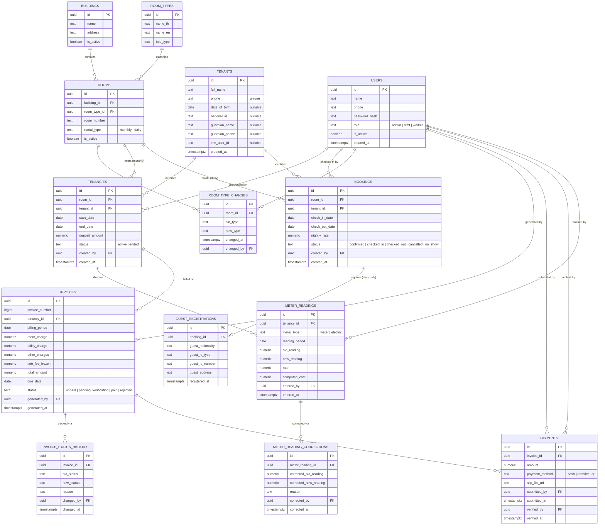

# AMANEW SMART MANAGEMENT SYSTEM — MASTER DOCUMENT
### Complete Phase 1 specification, combined. Single source of truth for development.
### All prior standalone files are merged here; this file supersedes them for day-to-day reference. Version: pre-demo freeze.

---

# TABLE OF CONTENTS

| # | Section | What question it answers | Read it when... |
|---|---|---|---|
| 1 | Architecture Specification v1.0 | What are the business rules and what's in/out of scope? | Starting any work; resolving any scope question |
| 2 | Architecture Decision Records (ADR-001 to ADR-018) | Why was each decision made? | You're about to change something and need to know why it is the way it is |
| 3 | Entity Relationship Diagram | How does the data connect? | Designing a query or a new table |
| 4 | PostgreSQL Schema | The actual database — tables, constraints, triggers | Week 1 of development; any DB work |
| 5 | API Specification | Every endpoint, per role, with error behavior | Building any backend route or frontend call |
| 6 | Frontend Specification | Screens, device rules, UX behavior per role | Building any screen |
| 7 | Development Roadmap | What gets built in which of the 8 weeks? | Planning; checking what's in the current week |
| 8 | Demo Specification | What the owner demo shows, on what device, with what data | Preparing the demo |
| 9 | User Journeys (6) | Step-by-step: how staff move through each workflow, with API calls and failure paths | Building or testing any workflow end to end |
| 10 | Screen Inventory | Every screen, roles, and which components each uses | Finding which screen owns a behavior |
| 11 | Wireflow Specification | How screens connect; every branch mapped to a real API response; UI pattern principles | Wiring navigation; deciding modal vs dialog vs inline |
| 12 | Component Library (C01-C13 + design prototype components) | Every reusable UI piece, defined once | Building any screen — compose these, don't reinvent |
| 13 | State Model | Every state machine that exists (and the ones that deliberately don't) | Building badges, enums, transitions, or tests |
| 14 | Error Catalogue | Every error, its code, where it appears, and its recovery path | Building error handling; writing QA cases |
| 15 | Design System Adoption | Which design system, which style, how design-prototype IDs map to architecture IDs | Starting any frontend implementation |
| 16 | Phase Map | Every feature across all phases, with role assignments | Answering "is X in scope" or "when does Y happen" |
| **17** | **Phase 1 Scope Delta (2026-08-01)** | **What the owner added after this document was frozen — 17 screens, their schema/API implications, and which rules changed** | **Before trusting §10's screen inventory, §4's schema, or §16's phase assignments — all three predate these additions** |

**Open items requiring the owner (updated):**
- §6.1 Hotel Act license status
- §6.2 PDPA data retention / national ID storage
- Staff access to tenant payment history (Admin-only recommended, owner's call)
- Owner picks a visual style: A (Clean Professional), B (Warm Thai), or C (Bold Operator)

Neither blocks development start.

**What is deliberately NOT in this document:** testing matrix (created against the finished screens during development planning), and anything Phase 2+ not yet built (see Phase Map in Section 16 for the complete deferred list).

---


════════════════════════════════════════════════════════════
# SECTION 1: ARCHITECTURE SPECIFICATION v1.0
════════════════════════════════════════════════════════════

# Amanew Architecture Specification v1.0
### Status: Frozen baseline for Phase 1 development
### Supersedes: all prior review notes, chat discussion, and draft prompts

This document is the single source of truth for the Amanew Smart Management System architecture. It does not introduce new features. It consolidates every recommendation raised during the architecture review into one of four dispositions and states the frozen project constraints they operate within.

---

## 0. Frozen Project Constraints

These are accepted as-is and are not re-litigated anywhere below unless a recommendation explicitly flags a critical conflict with one of them.

- Permissions are per-person checkboxes, not fixed roles — the named "roles" (Admin, Staff, Worker) are preset tick-combinations a person can be assigned, not hardcoded permission sets. *(Corrected 2026-07-31 — this line previously read "3 roles only: Admin, Staff, Worker," which conflicted with `Amanew_Functional_Spec_v1.0.md` §2's checkbox/7-preset model, CLAUDE.md rule #6, and the already-built S26 Staff & Permissions screen. Resolved in favor of the checkbox model per owner decision; see `PROGRESS.md` decisions log.)*
- Rooms are strictly **Monthly** or **Daily** — no `rental_type = 'both'`
- Modular Monolith architecture
- Backend: Express + TypeScript
- Database: PostgreSQL (Supabase)
- Authorization enforced in Express — **no PostgreSQL Row-Level Security**
- Cash-book accounting only — no enterprise accounting
- No AI/ML features
- Phase 1 scope: Room Dashboard, Daily Check-in, Monthly Billing, Payment Verification

---

## 1. Disposition Key

| Disposition | Meaning |
|---|---|
| **Accepted** | Part of the frozen v1.0 specification. Build it as described. |
| **Rejected** | Not suitable for this project, superseded by a simpler accepted approach, or out of scope given the frozen constraints. |
| **Deferred to Phase 2** | Valuable, intentionally postponed. Not built in Phase 1; schema shape may still be reserved where noted. |
| **Needs Owner Decision** | Depends on business/legal policy, not technical design. Blocks nothing in Phase 1 except where stated. |

---

## 2. Rooms, Bookings & Occupancy

### 2.1 Unified `room_occupancy` table across bookings and tenancies
**Disposition: Rejected (superseded).**
This was originally proposed to prevent a daily booking and a monthly tenancy from ever claiming the same room simultaneously. That risk existed specifically because `rental_type = 'both'` allowed one room to appear in both `bookings` and `tenancies`. With rooms now strictly Monthly or Daily, a given room can only ever be referenced by one of those two tables in an active state — the cross-table conflict this table was designed to prevent no longer exists by construction. Building it now would add complexity without solving a live problem. The simpler split-constraint approach below is accepted instead.

### 2.2 `EXCLUDE` constraint on `bookings` (daily overlap prevention)
**Disposition: Accepted — Phase 1.**
Unchanged from original recommendation. Prevents two daily bookings from overlapping on the same room and date range at the database level, independent of application logic.

### 2.3 Partial unique index on `tenancies` (one active tenancy per room)
**Disposition: Accepted — Phase 1.**
`UNIQUE (room_id) WHERE status = 'active'`. This is the monthly-side equivalent of 2.2 and closes the walk-in race condition where two staff members check in different tenants to the same room within seconds of each other. Required regardless of role count — this is a database integrity issue, not a permissions issue.

### 2.4 Room type transition guard
**Disposition: Accepted — Phase 1.**
A room's `rental_type` must not be changeable while an active `tenancies` row or future-dated `bookings` row references it. Enforced via a trigger or application-level check backed by a `CHECK`/constraint, plus a small append-only `room_type_changes` log (`room_id`, `old_type`, `new_type`, `changed_at`, `changed_by`). This is cheap now and prevents a historical-reporting gap ("how many daily rooms did we have in March") that is expensive to reconstruct after the fact.

### 2.5 `room_types` lookup table (replacing free-text `room_type_name` / `bed_type`)
**Disposition: Accepted — Phase 1.**
Small normalization fix: `room_types (id, name_th, name_en, bed_type)` with `rooms.room_type_id` as a foreign key, replacing free-text fields. Not an enterprise feature — a dropdown backed by 4-6 rows costs nothing in an 8-week build and avoids fuzzy-matching problems in future reporting once staff have entered inconsistent spellings over time.

### 2.6 Booking modification/cancellation state machine
**Disposition: Accepted — Phase 1 (minimal version only).**
Since Daily Check-in is explicitly in Phase 1 scope, `bookings.status` needs at minimum: `confirmed → checked_in → checked_out`, plus `cancelled` and `no_show`. Extensions and reassignments are handled as ordinary new booking attempts subject to the existing `EXCLUDE` constraint (2.2) — no special-case logic required. This is the minimum viable state machine, not the full policy layer (refund rules, extension UX) — those are Phase 2.

---

## 3. Tenancy, Billing & Invoicing

### 3.1 Invoice numbering via PostgreSQL `SEQUENCE`
**Disposition: Accepted — Phase 1.**
Never derive invoice numbers from `MAX(invoice_number) + 1`. A Postgres sequence (or `SELECT ... FOR UPDATE` on a per-building counter) is required to prevent collisions during month-end batch invoice generation across 60 rooms. This is a correctness requirement, not a scale requirement — it applies identically at 60 rooms or 600.

### 3.2 Invoice immutability
**Disposition: Accepted — Phase 1.**
Once issued, an invoice's amount and line items are never `UPDATE`d. Corrections happen through a linked adjustment/credit entry, preserving the original record. This matters more with only 3 roles, not less: if Staff can both generate and later silently edit an invoice, there is no independent check on that action. Immutability plus 3.4 (audit trail) together substitute for the segregation of duties that a larger role set would otherwise provide.

### 3.3 Invoice status: add `rejected` state
**Disposition: Accepted — Phase 1.**
The flow `unpaid → pending_verification → paid` is extended with an explicit `rejected` state (with required `rejection_reason`, `rejected_by`, `rejected_at`) for slips that don't match. Without this, a rejected slip has no distinguishable record from "never submitted," which becomes a dispute liability the first time a tenant claims they paid.

### 3.4 Append-only audit tables (`invoice_status_history`, `meter_reading_corrections`, `deposit_deductions`)
**Disposition: Accepted — Phase 1.**
Given the frozen decision not to use RLS, these tables are the primary compensating control. Enforce append-only behavior with `REVOKE UPDATE, DELETE` on the application's database role for these specific tables (or a rejecting trigger if role-level revocation isn't practical in Supabase's setup). This is a small, one-time addition, not an ongoing enterprise audit system.

### 3.5 Payment verification restricted to Admin
**Disposition: Accepted — Phase 1.**
With only 3 roles, Staff will realistically handle both recording and, absent this rule, verifying payments — removing any independent check on cash handling. Restricting the `pending_verification → paid` transition to Admin is a single permission rule, not a new role, and directly closes the largest fraud gap created by collapsing 8 roles into 3.

### 3.6 POS charge-to-room ledger design
**Disposition: Deferred to Phase 2.**
POS/Minimart is not in Phase 1 scope, so the earlier concern about monthly tenants' unbilled charges is deferred along with the feature itself. No schema commitment needed now; when POS is built, charges should be modeled as their own ledger rows with an `unbilled`/`billed` status swept into whichever invoice-generation event happens next (monthly cycle or early termination) — noted here so the decision isn't lost, not to be built in Phase 1.

### 3.7 Deposit deduction itemization
**Disposition: Deferred to Phase 2 (schema shape may be reserved now).**
Full deposit deduction/refund workflow (itemized damages, evidence photos, approval, shortfall billing) is a Phase 2 feature per the original phasing. Reserving the table shape (`deposit_deductions`) now is low-cost but not required to unblock Phase 1, since Phase 1 doesn't include checkout/deposit-return flows.

### 3.8 Late fee freeze at payment time
**Disposition: Accepted — Phase 1.**
Live calculation for display is fine, but the late fee amount must be frozen/snapshotted at the moment a payment is submitted, and stored on the invoice record (`invoices.late_fee_frozen`). Without this, the same invoice shows a different late fee depending on when it's viewed, which becomes a direct dispute source with tenants — a correctness issue, not a nice-to-have.

*(Correction, applied during implementation review: ADR-009 originally described this value as snapshotted onto the payment record. The invoice is the correct location — one invoice can only ever have one frozen late fee, and the ERD/schema/API were already consistent with that. ADR-009's wording has been corrected to match; no schema change was needed.)*

### 3.9 Tenant identity (`tenants` table)
**Disposition: Accepted — Phase 1 (schema addition).**
Originally, `tenancies` and `bookings` each stored a tenant/guest name and phone number as free text, with no shared identity linking a person's stays across time. This blocks anything the owner might reasonably want later — repeat-stay history, per-tenant payment behavior, age/demographics — and retrofitting an identity table after months of free-text tenancy data exist is a real migration problem (matching/deduplicating names and phone numbers typed by different staff members over time), not a quick add. This is the same shape of problem `room_types` solved for free-text room categories (§2.5), applied to people instead of rooms.

A minimal `tenants` table is added now: `id`, `full_name`, `phone` (unique), `date_of_birth` (nullable), `national_id` (nullable). `tenancies.tenant_id` and `bookings.tenant_id` reference it, replacing the free-text name/phone fields on those tables. This does not add any reporting or analytics functionality in Phase 1 — it only ensures the data exists in a shape that makes such reporting possible later without a migration. See §10 for what this enables.

**Legal note:** `date_of_birth` and `national_id` are optional fields, collected only where the business already needs them (e.g. `national_id` mirrors what daily-stay `guest_registrations` already captures under Hotel Act requirements — this is not a new PII category, just a shared home for it across stay types). See §6.2 for the retention question this raises.

---

## 4. Meter Readings

### 4.1 Uniqueness per billing period
**Disposition: Accepted — Phase 1.**
`UNIQUE (tenancy_id, reading_period)` prevents duplicate reading entry for the same period, whether from a double-submit on a bad connection or two staff members entering the same reading independently.

### 4.2 No pre-filled opening reading at check-in
**Disposition: Accepted — Phase 1.**
The opening meter reading at a new tenancy's start must be entered fresh, never auto-copied from the previous tenancy's closing reading. Add a sanity check rejecting/flagging an opening reading lower than the prior tenancy's closing reading (absent a logged meter-replacement event). This is the correctness fix for business rule #3 ("new tenant never pays for previous tenant's usage") — currently enforced only by staff memory.

---

## 5. Authorization & Roles

### 5.1 No PostgreSQL RLS
**Disposition: Accepted (frozen constraint) — with compensating controls.**
This is a frozen decision and is not being reopened. Given no RLS, the compensating controls already listed above (3.4 append-only audit tables, 3.5 Admin-only verification, immutable invoices) are the mechanisms doing the work RLS would otherwise do. These are accepted as part of this specification precisely because RLS is off the table — they are not optional extras.

### 5.2 `role` stored as `TEXT` with a `CHECK` constraint, not a Postgres `ENUM`
**Disposition: Accepted — Phase 1.**
Maintainability/migration decision: a `CHECK (role IN ('admin','staff','worker'))` is trivially alterable if roles are ever refined later, whereas a native Postgres enum type is more disruptive to modify. This does not reopen the 3-role decision — it only concerns how that decision is stored.

### 5.3 Worker role has no access path to guest registration / tenant PII
**Disposition: Accepted — Phase 1.**
A permission rule, not a schema change: Worker (housekeeping/maintenance) has no operational need for guest ID/passport data and should have no query path that returns it, even incidentally through a joined dashboard view.

### 5.4 Multi-building user scoping (`user_buildings` junction)
**Disposition: Deferred to Phase 2.**
Irrelevant while there is a single building. Noted so that if a second branch is opened later, this is a table addition rather than a retrofit of every role-scoped query. Not required for Phase 1.

---

## 6. Legal & Compliance

### 6.1 Hotel Act license status
**Disposition: Needs Owner Decision.**
Unchanged from the original finding. Guest registration data capture (required for daily-stay compliance under the Hotel Act) is a data problem the system solves; whether Amanew's daily-rental operation is legally licensed to operate at all is a business fact only the owner can confirm. This does not block the Room Dashboard, Daily Check-in mechanics, Monthly Billing, or Payment Verification work in Phase 1 — it specifically blocks treating the daily-booking guest-registration report as evidence of compliance until the owner confirms the licensing basis. Recommend resolving this in parallel with Phase 1 development, not as a blocker to starting, but before demoing daily-rental compliance features to the customer as "handled."

### 6.2 Data retention period for guest and financial records (PDPA)
**Disposition: Needs Owner Decision.**
`guest_registrations` stores passport/ID numbers and addresses; `tenants` (§3.9) will store national ID and date of birth; `invoices`/`payments`/`meter_readings` accumulate indefinitely by design (financial immutability, §3.2). None of this currently has a defined retention limit or deletion policy. Under Thailand's Personal Data Protection Act, indefinite retention of ID/passport data carries its own compliance exposure, separate from the Hotel Act requirement to capture it in the first place — capturing the data legally does not mean keeping it forever is also automatically legal. This is a business/legal policy question (how long must records be kept, and does anything need to be purged after that point), not a technical one, and should be resolved alongside §6.1 rather than decided unilaterally by the architecture. It does not block Phase 1 — no deletion mechanism is being built either way until this is answered — but it should not stay open indefinitely once the system holds real guest and financial data in production.

**The specific question to put to the owner:** *Do you currently photocopy or record tenant ID numbers at check-in today, on paper? If so, storing that same number digitally doesn't create a new category of risk you don't already carry — but it does mean that if the database is ever compromised, you'd be subject to PDPA's data-breach notification requirements in a way a paper filing cabinet realistically wouldn't surface the same way. Do you want `national_id` stored in the system at all, or should the field stay optional/rarely-used and the ID verification stay on paper as it is today?* This is a yes/no the owner can answer directly — it does not require them to understand PDPA in detail, only to decide whether the convenience is worth that specific exposure.

---

## 7. Rejected / Out-of-Scope Items

Recorded for completeness so they are not silently reconsidered later.

- **Unified `room_occupancy` table (2.1)** — Rejected, superseded by split constraints (2.2 + 2.3), given the frozen strict Monthly/Daily rule.
- **AI-report disclaimers/versioning** — Rejected as out of scope; no AI/ML features per frozen constraints.
- **Shift/cash-drawer reconciliation** — Deferred to Phase 2, not Phase 1; not a correctness requirement for the Phase 1 feature set (no POS in Phase 1).
- **Announcement read-tracking** — Deferred to Phase 2; not part of Phase 1 scope (Room Dashboard, Check-in, Billing, Verification).
- **Loyalty/points expiry policy** — Deferred to Phase 3, consistent with original phasing; no schema commitment needed now.
- **Notification channel abstraction (LINE integration groundwork)** — Deferred to Phase 2; low-risk to add later, not required to unblock Phase 1.

---

## 8. Summary Table

| Item | Disposition | Phase |
|---|---|---|
| Unified room_occupancy table | Rejected (superseded) | — |
| `EXCLUDE` constraint on bookings | Accepted | 1 |
| Partial unique index on tenancies | Accepted | 1 |
| Room type transition guard + log | Accepted | 1 |
| `room_types` lookup table | Accepted | 1 |
| Booking status state machine (minimal) | Accepted | 1 |
| Invoice numbering via sequence | Accepted | 1 |
| Invoice immutability | Accepted | 1 |
| Invoice `rejected` state | Accepted | 1 |
| Append-only audit tables | Accepted | 1 |
| Payment verification restricted to Admin | Accepted | 1 |
| POS charge-to-room ledger | Deferred | 2 |
| Deposit deduction itemization | Deferred (schema optional now) | 2 |
| Late fee freeze at payment time | Accepted | 1 |
| Meter reading uniqueness constraint | Accepted | 1 |
| No pre-filled opening meter reading | Accepted | 1 |
| No RLS (frozen) + compensating controls | Accepted | 1 |
| `role` as TEXT + CHECK, not ENUM | Accepted | 1 |
| Worker excluded from guest PII | Accepted | 1 |
| Multi-building user scoping | Deferred | 2 |
| Hotel Act license status | Needs Owner Decision | — |
| Data retention period (PDPA) | Needs Owner Decision | — |
| Shift/cash reconciliation | Deferred | 2 |
| Announcement read-tracking | Deferred | 2 |
| Loyalty points expiry | Deferred | 3 |
| Notification channel field | Deferred | 2 |
| `tenants` table (identity for tenancies/bookings) | Accepted | 1 |
| Owner insights / tenant analytics reporting | Deferred | 2/3 |
| `maintenance_requests` table | Deferred | 2 |

---

## 9. What This Freezes

Phase 1 development can proceed against Section 0 (frozen constraints) plus every item marked **Accepted** above. Nothing marked Deferred blocks Phase 1 work. Two open items — §6.1 (Hotel Act license status) and §6.2 (data retention period) — are business questions to route to the owner in parallel; neither blocks engineering start.

This document is the baseline. Future changes require a stated critical issue (data corruption, incorrect financial records, legal non-compliance, security vulnerability, expensive migration, or maintainability problem) — not preference.

---

## 10. Owner Insights & Tenant Analytics — Phase 2/3 Candidate

Raised by the owner directly: the long-term value of this system isn't only running day-to-day operations, but giving the owner something to look back on after months or years of use — tenant history, payment behavior, recurring problems. This section records that intent and sequences it honestly by how much history each piece actually needs before it says anything useful. None of this is built in Phase 1 except §3.9 (the `tenants` table), which is a prerequisite, not a report.

### 10.1 Available immediately (no accumulated history required)
Current occupancy snapshot, which invoices are unpaid/overdue right now, cash collected this period vs. last, current most-overdue tenant. These are current-state queries against data that exists the moment the system goes live — not analytics, just reporting. Feasible in Phase 2 with no new tables.

### 10.2 Meaningful after roughly 3–6 months
- **Per-tenant payment timeliness** ("this person is consistently N days late") — requires multiple invoices linked to one `tenant_id` (§3.9) before a pattern can be distinguished from a single incident. The underlying data (`invoices.due_date`, `payments.submitted_at`) already exists; this is a reporting layer once tenant identity is in place, not a new data source.
- **Room/room-type performance** (vacancy duration, turnover rate) — needs multiple tenancy cycles per room to distinguish a genuinely less-desirable room from one that happened to be empty in a given month.
- **Maintenance/complaint patterns** — requires a new table, since nothing currently captures what tenants report. `maintenance_requests` (or similar): room, tenant, category, description, reported_at, status, resolved_at. **Disposition: Deferred to Phase 2 — schema not yet built.** Deliberately minimal — no SLA tracking or priority queues; this is a 60-room property, not a helpdesk platform. Even a few months of reports starts showing which rooms recur.

### 10.3 Meaningful only after a full year or more
- **Seasonality** in daily-booking demand — a full year is needed before the system can tell a naturally slow month from an actual problem.
- **Tenant renewal/retention rate** — only exists as a number once contracts have had the chance to reach their natural end and either renew or not.
- **Room-level lifetime value** — total revenue net of vacancy/maintenance history, useful for prioritizing which rooms to renovate.
- **Utility usage anomalies** — comparing a room's current reading against *that room's own historical baseline* (not just last month) is a much stronger leak/tampering signal with a year of data behind it than with one or two data points.

### 10.4 Consequence for Phase 1 scope
Only §3.9 (`tenants` table) is pulled forward into Phase 1, and only as a schema decision — no reporting UI, no analytics endpoints. Everything else in this section is explicitly Deferred and requires no Phase 1 work beyond making sure `tenancies`/`bookings` reference `tenant_id` from the start, so that Phase 2 reporting doesn't need a data migration to attach to.

### 10.5 Open question this creates
Reporting queries against 2+ years of `meter_readings`/`invoices`/`guest_registrations` should be designed against year-scoped ranges from the start (Phase 2 API design concern), rather than "select everything and filter in the app" — not urgent at 60 rooms today, but cheap to get right from the outset and awkward to retrofit once dashboards are already built around unbounded queries.


════════════════════════════════════════════════════════════
# SECTION 2: ARCHITECTURE DECISION RECORDS
════════════════════════════════════════════════════════════

# Amanew — Architecture Decision Records

Each ADR reflects a decision already marked **Accepted** in Architecture Specification v1.0. These are recorded here in standard ADR form for implementation reference. Status on every record below is **Accepted** unless noted.

---

### ADR-001: Rooms are strictly Monthly or Daily
**Context:** Early design considered a `'both'` rental type per room, which created a cross-table double-booking risk between `bookings` and `tenancies`.
**Decision:** `rooms.rental_type` is a required field with exactly two allowed values: `monthly`, `daily`. A room cannot serve both modes concurrently.
**Consequences:** Eliminates the need for a unified occupancy table. Room-type changes must go through a guarded transition (ADR-004), since flipping type on a room with an active reference would otherwise be silent and unaudited.

---

### ADR-002: Occupancy conflicts are prevented per-table, not via a unified table
**Context:** A unified `room_occupancy` table was proposed to guarantee no room is claimed twice. With ADR-001 in place, the specific conflict it solved (a room appearing in both tables at once) cannot occur.
**Decision:** Use a PostgreSQL `EXCLUDE` constraint on `bookings` (daterange overlap) and a partial unique index on `tenancies` (`UNIQUE room_id WHERE status = 'active'`). No unified occupancy table.
**Consequences:** Two independent, simple constraints instead of one shared table. Less migration surface, no shared-table lock contention between the daily and monthly workflows.

---

### ADR-003: Invoice numbers are generated from a PostgreSQL `SEQUENCE`
**Context:** Naive `MAX(invoice_number) + 1` generation collides under concurrent month-end batch invoice generation.
**Decision:** A dedicated Postgres sequence (`invoice_number_seq`) backs `invoices.invoice_number`. No invoice number is ever computed by querying existing rows.
**Consequences:** Invoice numbers are gapless-enough and collision-proof under concurrency. A gap can only occur from a rolled-back transaction, which is acceptable and auditable (unlike a duplicate).

---

### ADR-004: Room type changes are guarded and logged
**Context:** Nothing previously prevented changing a room's `rental_type` while it held an active tenancy or future booking.
**Decision:** A trigger blocks any `UPDATE` to `rooms.rental_type` while an active `tenancies` row or future-dated `bookings` row references that room. Every successful change is recorded in `room_type_changes` (append-only).
**Consequences:** Historical reporting ("how many daily rooms existed in March") remains reconstructable. Changing a room's type is a deliberate, auditable action, not a silent field edit.

---

### ADR-005: Invoices are immutable once issued
**Context:** With only 3 roles, the same person who generates an invoice could otherwise also edit it after the fact with no independent check.
**Decision:** `invoices` rows are never `UPDATE`d for amount or line-item fields after creation. Corrections are made via a linked adjustment entry referencing the original invoice, not by editing it.
**Consequences:** The financial record for any billing period is permanent. Disputes are resolved by inspecting the adjustment trail, not by trusting that no one touched the original number.

---

### ADR-006: Append-only audit tables substitute for the absence of RLS
**Context:** The project frozen constraint excludes PostgreSQL Row-Level Security; authorization lives entirely in Express.
**Decision:** `invoice_status_history`, `meter_reading_corrections`, `room_type_changes`, and `guest_registrations` are append-only. The application's database role has `UPDATE`/`DELETE` revoked on these four tables (or, where Supabase role management makes that impractical, a rejecting trigger enforces the same behavior).
**Consequences:** Even if an Express authorization check is buggy or bypassed, these tables cannot be altered or deleted after the fact — the last line of defense the project relies on in place of RLS. `guest_registrations` was added to this list after the initial draft (originally omitted despite being legally-mandated Hotel Act data) — see amendment note below.

*(Amendment, applied during implementation review: `guest_registrations` was found excluded from this list despite its data being exactly the kind this ADR exists to protect. Consequence of the omission, now closed: since Phase 1 has no correction mechanism analogous to `meter_reading_corrections`, a mistyped guest ID currently has no fix path other than cancelling and recreating the booking. Accepted as a minor workflow gap for Phase 1 — reuses the existing cancellation flow rather than inventing a new correction table; revisit only if mistyped guest data proves to be a frequent problem in practice.)*

---

### ADR-007: Payment verification requires the Admin role
**Context:** Staff can realistically both record a payment slip and (absent this rule) verify it, removing any independent check on cash handling.
**Decision:** The `pending_verification → paid` transition on `invoices`/`payments` is permitted only for users with `role = 'admin'`, enforced in the Express authorization middleware and confirmed by the `verified_by` foreign key requiring an admin user.
**Consequences:** No single Staff-level actor can both receive and confirm a payment unilaterally.

---

### ADR-008: Meter readings are unique per tenancy, meter type, and billing period, and never pre-filled
**Context:** Duplicate reading entry and copy-forward of a prior tenant's closing reading were both identified as data-integrity risks.
**Decision:** `UNIQUE (tenancy_id, meter_type, reading_period)` on `meter_readings` (widened by ADR-015 to add `meter_type` — this ADR's original text said `UNIQUE (tenancy_id, reading_period)`, which became inaccurate once `meter_type` was added and is corrected here rather than left to silently contradict ADR-015). The opening reading for a new tenancy is a required, blank input at check-in — never defaulted from the previous tenancy's closing value. A check constraint flags (does not hard-block, to allow legitimate meter replacement) any new reading lower than the immediately preceding one for that room.
**Consequences:** Billing continuity between tenants is enforced at the data layer, not left to staff memory.

---

### ADR-009: Late fees are frozen at time of payment
**Context:** Live-calculated late fees produce a different number depending on when an invoice is viewed, creating dispute risk once a payment has actually been submitted.
**Decision:** Live calculation is used only for display on still-unpaid invoices. The moment a payment is submitted (slip uploaded), the late fee amount is snapshotted onto the **invoice** record (`invoices.late_fee_frozen`) and never recalculated retroactively.
**Consequences:** What a tenant was told they owed and what the record shows after payment always match.

*(Correction, applied during implementation review: this ADR originally said the value was snapshotted onto the "payment record" and left the trigger point ambiguous between submission and verification. The invoice is correct — one invoice has exactly one frozen late fee, matching the ERD, schema, and API, which were already consistent with each other on this point — and the trigger point is submission, not verification. Only this ADR's wording was wrong; no schema/ERD/API change was made.)*

---

### ADR-010: `role` and `rental_type` are `TEXT` + `CHECK`, not native Postgres `ENUM`
**Context:** Both fields could plausibly need new allowed values later (roles if the business grows; rental type if the owner requests more flexibility).
**Decision:** Both fields are `TEXT` columns constrained by a `CHECK (... IN (...))` clause, not a Postgres `ENUM` type.
**Consequences:** Adding a new allowed value later is an `ALTER TABLE ... DROP CONSTRAINT / ADD CONSTRAINT`, not a schema-wide enum migration.

---

### ADR-011: Guest registration is captured at booking time for legal compliance
**Context:** Daily-stay guest registration (name, nationality, ID/passport, address) is a Hotel Act data requirement, independent of the still-open licensing question (Needs Owner Decision in Architecture Specification v1.0 §6.1).
**Decision:** A `guest_registrations` table, one row per `booking_id`, captures the required fields at check-in. This is built in Phase 1 alongside Daily Check-in regardless of the licensing question's resolution, since the data-capture requirement applies whenever daily stays occur.
**Consequences:** The system is ready to produce a compliant guest registry the moment the licensing question is resolved. It does not, by itself, resolve that question — see the Needs Owner Decision item, unchanged.

---

### ADR-012: Deposit and POS-charge workflows are out of Phase 1 schema scope
**Context:** Phase 1 scope is Room Dashboard, Daily Check-in, Monthly Billing, Payment Verification. Deposit deduction itemization and POS charge-to-room ledgers were both marked Deferred to Phase 2.
**Decision:** Phase 1 schema includes a simple `deposit_amount` field on `tenancies` (collected, not itemized) and no POS-related tables at all. No deduction workflow, no ledger.
**Consequences:** Deposit refund/deduction and POS billing integration are schema additions in Phase 2, not migrations against Phase 1 data — the Phase 1 field is additive-compatible with the future `deposit_deductions` table.

---

### ADR-013: A `tenants` table is introduced in Phase 1 as the shared identity for tenancies and bookings
**Context:** Requested directly by the owner — the ability to eventually see repeat-stay history, payment behavior per person, and demographics across a tenant's full relationship with the property, not just a single stay. `tenancies` and `bookings` originally stored name/phone as free text with no shared identity linking a person's stays over time.
**Decision:** A `tenants` table (`id`, `full_name`, `phone` unique, `date_of_birth` nullable, `national_id` nullable) is added in Phase 1. `tenancies.tenant_id` and `bookings.tenant_id` reference it, replacing the free-text name/phone fields on those tables. No reporting, analytics, or UI is built against this table in Phase 1 — it exists purely so Phase 2 reporting (Architecture Specification §10) doesn't require a data migration to attach to.
**Consequences:** Same normalization rationale as `room_types` (ADR-004's counterpart decision, Specification §2.5), applied to people instead of rooms. Retrofitting shared identity after months of free-text tenancy/booking data exist would require a matching/deduplication migration against real production data — this avoids that entirely by deciding it before any tenancy data exists. Collecting `national_id`/`date_of_birth` reopens the retention question already flagged for `guest_registrations` — see Specification §6.2 (Needs Owner Decision), not resolved by this ADR.

---

### ADR-014: Tenant-facing analytics and maintenance/complaint tracking are Deferred, not built against in Phase 1
**Context:** The owner's broader request (Specification §10) includes payment-timeliness reporting, room performance, and recurring maintenance/complaint patterns. None of this has existing data to build on except payment timeliness, which depends on ADR-013 being in place first.
**Decision:** No reporting layer, dashboard, or `maintenance_requests` table is built in Phase 1. These are Deferred to Phase 2/3 per the time-horizon breakdown in Specification §10 — some of this data isn't meaningful until 3-6 months or a full year of history accumulates regardless of when the code is written.
**Consequences:** Nothing in Phase 1 needs to change to accommodate this later, provided ADR-013 (`tenant_id` on tenancies/bookings) is in place — the payment and stay-history data these future reports need is already being captured correctly from day one. `maintenance_requests` is a genuinely new table with no Phase 1 precursor; it will be designed when Phase 2 begins, not now.

---

### ADR-015: `meter_readings` requires a `meter_type` discriminator; readings are submitted in a single batched call per period
**Context:** Discovered during journey-mapping the meter reading flow (`14_user_journey_meter_reading.md`), not during original schema design. The original `UNIQUE (tenancy_id, reading_period)` constraint allowed only one reading per tenancy per billing month — but Amanew bills both electric and water for the same tenancy in the same period, which the schema had no way to represent. Worth noting honestly: an earlier round surfaced this exact issue via a report with fabricated citations (invented Architecture Specification sections that don't exist), which was correctly rejected at the time on the grounds that its evidence was fake. The underlying technical problem turned out to be real regardless — confirmed independently by tracing the actual journey against the live schema, not by trusting that report after the fact.
**Decision:**
1. Add `meter_type TEXT NOT NULL CHECK (meter_type IN ('water', 'electric'))` to `meter_readings`; change the uniqueness constraint to `UNIQUE (tenancy_id, meter_type, reading_period)`.
2. `TEXT` + `CHECK`, not a `meter_types` reference table, per the same reasoning as ADR-010 — a reference table was considered and is explicitly deferred, not rejected outright: electric and water are a fixed, stable pair for this building type today, unlike `room_types`, which was already drifting as free text across many staff entries before it was normalized. If the owner adds a third utility (gas, solar) later, that's the trigger to revisit this as a reference table, not a reason to build one preemptively now.
3. `POST /tenancies/:id/meter-readings` accepts **one or more** readings per submission, not exactly two — buildings are messy in practice (a water meter can be inaccessible on a given visit, a meter can be mid-replacement), and the API shouldn't force an all-or-nothing entry that blocks recording the utility that *is* accessible. This corrects an earlier internal inconsistency: this ADR originally said the endpoint "accepts both readings," while `04_API_spec.md` already said "one or both" — the API spec's wording was the correct one, and this ADR is corrected to match it rather than the reverse.
4. **Invoice generation, not reading entry, is where completeness is enforced.** `POST /tenancies/:id/invoices` requires both a `water` and an `electric` row to exist for the billing period before it will succeed — if either is missing, generation is blocked with a message identifying which utility is missing, rather than silently generating a partial-utility invoice. This keeps entry flexible while keeping billing correct: staff can record whichever meter they read today, but nobody gets billed on incomplete data.
**Consequences:** `invoices.utility_charge` is computed by summing `computed_cost` across both `meter_type` rows for the period once both exist — invoice generation is now a completeness-gated action, not just a "does at least one reading exist" check (`04_API_spec.md` updated accordingly). Rate-freezing was verified as already correct and required no change: `rate` is captured per-row at entry time, and `computed_cost` is a `GENERATED ALWAYS AS ... STORED` column derived from that same row — there is no live tariff table it could re-read from later, so a rate change next month cannot retroactively alter a past invoice.


════════════════════════════════════════════════════════════
# SECTION 3: ENTITY RELATIONSHIP DIAGRAM
════════════════════════════════════════════════════════════

# Amanew — Entity Relationship Diagram (Phase 1)

Scope: Room Dashboard, Daily Check-in, Monthly Billing, Payment Verification. Tables for deferred Phase 2/3 features (POS, deposit deductions, shifts, announcements, multi-building user scoping, `maintenance_requests`) are intentionally not shown here — see Architecture Specification v1.0 §7 and §10 for the deferred list. `TENANTS` is the one exception pulled into Phase 1 ahead of any reporting feature — see §3.9 and ADR-013.



## Notes on relationships that carry enforcement, not just reference

- `ROOMS → TENANCIES`: enforced 1-active-at-a-time via partial unique index, not shown as a cardinality symbol above but implemented in the schema (ADR-002).
- `ROOMS → BOOKINGS`: enforced non-overlap via `EXCLUDE` constraint, same caveat.
- `BOOKINGS → GUEST_REGISTRATIONS`: required only when the parent room's `rental_type = 'daily'`; enforced at the application layer during check-in, not a database-level conditional FK.
- `INVOICE_STATUS_HISTORY`, `METER_READING_CORRECTIONS`, `ROOM_TYPE_CHANGES`, `GUEST_REGISTRATIONS`: append-only (ADR-006) — no update/delete path exists once a row is written. `GUEST_REGISTRATIONS` was added to this set after being found missing from it during implementation review; there is no correction table for it in Phase 1 (see ADR-006 amendment note).
- `TENANTS → TENANCIES`/`BOOKINGS`: introduced in Phase 1 (ADR-013) specifically so repeat-stay history and per-tenant payment reporting are possible in Phase 2 without a data migration — no reporting is built against this relationship yet.


════════════════════════════════════════════════════════════
# SECTION 4: POSTGRESQL SCHEMA
════════════════════════════════════════════════════════════

```sql
-- ============================================================
-- Amanew Smart Management System — Phase 1 PostgreSQL Schema
-- Implements Architecture Specification v1.0 (frozen)
-- Every constraint below traces back to an Accepted ADR.
-- ============================================================

-- Required for EXCLUDE constraint using daterange overlap (ADR-002)
CREATE EXTENSION IF NOT EXISTS btree_gist;
CREATE EXTENSION IF NOT EXISTS pgcrypto; -- for gen_random_uuid()

-- ------------------------------------------------------------
-- USERS  (ADR-007, ADR-010)
-- ------------------------------------------------------------
CREATE TABLE users (
    id              UUID PRIMARY KEY DEFAULT gen_random_uuid(),
    name            TEXT NOT NULL,
    phone           TEXT UNIQUE NOT NULL,
    password_hash   TEXT NOT NULL,
    role            TEXT NOT NULL CHECK (role IN ('admin', 'staff', 'worker')), -- ADR-010: TEXT+CHECK, not ENUM
    is_active       BOOLEAN NOT NULL DEFAULT TRUE,
    created_at      TIMESTAMPTZ NOT NULL DEFAULT now()
);

-- ------------------------------------------------------------
-- BUILDINGS
-- ------------------------------------------------------------
CREATE TABLE buildings (
    id          UUID PRIMARY KEY DEFAULT gen_random_uuid(),
    name        TEXT NOT NULL,
    address     TEXT,
    is_active   BOOLEAN NOT NULL DEFAULT TRUE
);

-- ------------------------------------------------------------
-- ROOM_TYPES  (normalization fix — replaces free-text fields)
-- ------------------------------------------------------------
CREATE TABLE room_types (
    id          UUID PRIMARY KEY DEFAULT gen_random_uuid(),
    name_th     TEXT NOT NULL,
    name_en     TEXT NOT NULL,
    bed_type    TEXT NOT NULL
);

-- ------------------------------------------------------------
-- ROOMS  (ADR-001: strictly monthly or daily)
-- ------------------------------------------------------------
CREATE TABLE rooms (
    id              UUID PRIMARY KEY DEFAULT gen_random_uuid(),
    building_id     UUID NOT NULL REFERENCES buildings(id) ON DELETE RESTRICT,
    room_type_id    UUID NOT NULL REFERENCES room_types(id) ON DELETE RESTRICT,
    room_number     TEXT NOT NULL,
    rental_type     TEXT NOT NULL CHECK (rental_type IN ('monthly', 'daily')), -- ADR-001, ADR-010
    is_active       BOOLEAN NOT NULL DEFAULT TRUE,
    UNIQUE (building_id, room_number)
);

-- ------------------------------------------------------------
-- ROOM_TYPE_CHANGES  (ADR-004: append-only log)
-- ------------------------------------------------------------
CREATE TABLE room_type_changes (
    id          UUID PRIMARY KEY DEFAULT gen_random_uuid(),
    room_id     UUID NOT NULL REFERENCES rooms(id) ON DELETE RESTRICT,
    old_type    TEXT NOT NULL,
    new_type    TEXT NOT NULL,
    changed_at  TIMESTAMPTZ NOT NULL DEFAULT now(),
    changed_by  UUID NOT NULL REFERENCES users(id) ON DELETE RESTRICT
);

-- Trigger: block rental_type change while an active tenancy or future booking exists (ADR-004)
CREATE OR REPLACE FUNCTION guard_room_type_change() RETURNS TRIGGER AS $$
BEGIN
    IF NEW.rental_type IS DISTINCT FROM OLD.rental_type THEN
        IF EXISTS (
            SELECT 1 FROM tenancies
            WHERE room_id = OLD.id AND status = 'active'
        ) THEN
            RAISE EXCEPTION 'Cannot change rental_type: room % has an active tenancy', OLD.id;
        END IF;
        IF EXISTS (
            SELECT 1 FROM bookings
            WHERE room_id = OLD.id
              AND status IN ('confirmed', 'checked_in')
              AND check_out_date >= CURRENT_DATE
        ) THEN
            RAISE EXCEPTION 'Cannot change rental_type: room % has a future/active booking', OLD.id;
        END IF;

        -- Log the change (append-only)
        INSERT INTO room_type_changes (room_id, old_type, new_type, changed_by)
        VALUES (OLD.id, OLD.rental_type, NEW.rental_type, current_setting('app.current_user_id', true)::UUID);
    END IF;
    RETURN NEW;
END;
$$ LANGUAGE plpgsql;

CREATE TRIGGER trg_guard_room_type_change
    BEFORE UPDATE ON rooms
    FOR EACH ROW
    EXECUTE FUNCTION guard_room_type_change();

-- ------------------------------------------------------------
-- TENANTS  (ADR-013: shared identity across tenancies and bookings)
-- ------------------------------------------------------------
CREATE TABLE tenants (
    id              UUID PRIMARY KEY DEFAULT gen_random_uuid(),
    full_name       TEXT NOT NULL,
    phone           TEXT NOT NULL UNIQUE,
    date_of_birth   DATE,       -- nullable; not collected at every check-in
    national_id     TEXT,       -- nullable; see Architecture Specification v1.0 §6.2 (retention, Needs Owner Decision)
    guardian_name   TEXT,       -- nullable; for student tenants (owner feedback)
    guardian_phone  TEXT,       -- nullable
    line_user_id    TEXT,       -- nullable; links to LINE Login (Phase 3) and LINE Notify (Phase 2); added now to avoid migration
    created_at      TIMESTAMPTZ NOT NULL DEFAULT now()
);

-- ------------------------------------------------------------
-- TENANCIES  (ADR-002: one active tenancy per room, ADR-012: simple deposit field, ADR-013: tenant identity)
-- ------------------------------------------------------------
CREATE TABLE tenancies (
    id              UUID PRIMARY KEY DEFAULT gen_random_uuid(),
    room_id         UUID NOT NULL REFERENCES rooms(id) ON DELETE RESTRICT,
    tenant_id       UUID NOT NULL REFERENCES tenants(id) ON DELETE RESTRICT,
    start_date      DATE NOT NULL,
    end_date        DATE,
    deposit_amount  NUMERIC(10,2) NOT NULL DEFAULT 0,
    status          TEXT NOT NULL DEFAULT 'active' CHECK (status IN ('active', 'ended')),
    created_by      UUID NOT NULL REFERENCES users(id) ON DELETE RESTRICT,
    created_at      TIMESTAMPTZ NOT NULL DEFAULT now(),
    CHECK (end_date IS NULL OR end_date >= start_date)
);

-- ADR-002: only one active tenancy per room at a time
CREATE UNIQUE INDEX uq_tenancies_one_active_per_room
    ON tenancies (room_id)
    WHERE status = 'active';

-- ------------------------------------------------------------
-- BOOKINGS  (ADR-002: EXCLUDE constraint prevents daily overlap)
-- ------------------------------------------------------------
CREATE TABLE bookings (
    id              UUID PRIMARY KEY DEFAULT gen_random_uuid(),
    room_id         UUID NOT NULL REFERENCES rooms(id) ON DELETE RESTRICT,
    tenant_id       UUID NOT NULL REFERENCES tenants(id) ON DELETE RESTRICT, -- ADR-013: same identity table as tenancies
    check_in_date   DATE NOT NULL,
    check_out_date  DATE NOT NULL,
    nightly_rate    NUMERIC(10,2) NOT NULL,
    status          TEXT NOT NULL DEFAULT 'confirmed'
                    CHECK (status IN ('confirmed', 'checked_in', 'checked_out', 'cancelled', 'no_show')),
    created_by      UUID NOT NULL REFERENCES users(id) ON DELETE RESTRICT,
    created_at      TIMESTAMPTZ NOT NULL DEFAULT now(),
    CHECK (check_out_date > check_in_date),

    -- ADR-002: no two active bookings on the same room may share overlapping dates.
    -- cancelled/no_show bookings are excluded from the conflict check.
    EXCLUDE USING gist (
        room_id WITH =,
        daterange(check_in_date, check_out_date, '[)') WITH &&
    ) WHERE (status IN ('confirmed', 'checked_in'))
);

-- ------------------------------------------------------------
-- GUEST_REGISTRATIONS  (ADR-011: Hotel Act data capture, daily bookings only)
-- ------------------------------------------------------------
CREATE TABLE guest_registrations (
    id                  UUID PRIMARY KEY DEFAULT gen_random_uuid(),
    booking_id          UUID NOT NULL UNIQUE REFERENCES bookings(id) ON DELETE RESTRICT,
    guest_nationality   TEXT NOT NULL,
    guest_id_type       TEXT NOT NULL CHECK (guest_id_type IN ('thai_id', 'passport', 'driving_license')),
    guest_id_number     TEXT NOT NULL,
    guest_address       TEXT NOT NULL,
    registered_at       TIMESTAMPTZ NOT NULL DEFAULT now()
);

-- ------------------------------------------------------------
-- METER_READINGS  (ADR-008: uniqueness + continuity)
-- ------------------------------------------------------------
CREATE TABLE meter_readings (
    id              UUID PRIMARY KEY DEFAULT gen_random_uuid(),
    tenancy_id      UUID NOT NULL REFERENCES tenancies(id) ON DELETE RESTRICT,
    meter_type      TEXT NOT NULL CHECK (meter_type IN ('water', 'electric')), -- ADR-015; TEXT+CHECK per ADR-010 pattern, not a reference table (see ADR-015 for why)
    reading_period  DATE NOT NULL, -- first day of the billing month
    old_reading     NUMERIC(10,2) NOT NULL,
    new_reading     NUMERIC(10,2) NOT NULL,
    rate            NUMERIC(10,4) NOT NULL, -- captured per-row at entry time; computed_cost below is therefore frozen and immune to later tariff changes
    computed_cost   NUMERIC(10,2) GENERATED ALWAYS AS ((new_reading - old_reading) * rate) STORED,
    entered_by      UUID NOT NULL REFERENCES users(id) ON DELETE RESTRICT,
    entered_at      TIMESTAMPTZ NOT NULL DEFAULT now(),
    CHECK (new_reading >= old_reading),
    UNIQUE (tenancy_id, meter_type, reading_period) -- ADR-008, ADR-015
);

-- ------------------------------------------------------------
-- METER_READING_CORRECTIONS  (ADR-006: append-only)
-- ------------------------------------------------------------
CREATE TABLE meter_reading_corrections (
    id                      UUID PRIMARY KEY DEFAULT gen_random_uuid(),
    meter_reading_id        UUID NOT NULL REFERENCES meter_readings(id) ON DELETE RESTRICT,
    corrected_old_reading   NUMERIC(10,2) NOT NULL,
    corrected_new_reading   NUMERIC(10,2) NOT NULL,
    reason                  TEXT NOT NULL,
    corrected_by            UUID NOT NULL REFERENCES users(id) ON DELETE RESTRICT,
    corrected_at            TIMESTAMPTZ NOT NULL DEFAULT now()
);

-- ------------------------------------------------------------
-- INVOICE NUMBER SEQUENCE  (ADR-003)
-- ------------------------------------------------------------
CREATE SEQUENCE invoice_number_seq START 1;

-- ------------------------------------------------------------
-- INVOICES  (ADR-003, ADR-005, ADR-009)
-- ------------------------------------------------------------
CREATE TABLE invoices (
    id              UUID PRIMARY KEY DEFAULT gen_random_uuid(),
    invoice_number  BIGINT NOT NULL UNIQUE DEFAULT nextval('invoice_number_seq'), -- ADR-003
    tenancy_id      UUID NOT NULL REFERENCES tenancies(id) ON DELETE RESTRICT,
    billing_period  DATE NOT NULL,
    room_charge     NUMERIC(10,2) NOT NULL DEFAULT 0,
    utility_charge  NUMERIC(10,2) NOT NULL DEFAULT 0,
    other_charges   NUMERIC(10,2) NOT NULL DEFAULT 0,
    late_fee_frozen NUMERIC(10,2), -- ADR-009: NULL until payment submitted; frozen thereafter
    total_amount    NUMERIC(10,2) NOT NULL,
    due_date        DATE NOT NULL,
    status          TEXT NOT NULL DEFAULT 'unpaid'
                    CHECK (status IN ('unpaid', 'pending_verification', 'paid', 'rejected')),
    generated_by    UUID NOT NULL REFERENCES users(id) ON DELETE RESTRICT,
    generated_at    TIMESTAMPTZ NOT NULL DEFAULT now(),
    UNIQUE (tenancy_id, billing_period)
);

-- ADR-005: invoices are immutable once issued — block edits to financial fields.
-- Status transitions still flow through invoice_status_history; this trigger blocks
-- direct edits to amount/line-item columns regardless of status.
CREATE OR REPLACE FUNCTION block_invoice_amount_edit() RETURNS TRIGGER AS $$
BEGIN
    IF (NEW.room_charge, NEW.utility_charge, NEW.other_charges, NEW.total_amount)
       IS DISTINCT FROM
       (OLD.room_charge, OLD.utility_charge, OLD.other_charges, OLD.total_amount) THEN
        RAISE EXCEPTION 'Invoices are immutable: create an adjustment entry instead of editing invoice %', OLD.id;
    END IF;
    RETURN NEW;
END;
$$ LANGUAGE plpgsql;

CREATE TRIGGER trg_block_invoice_amount_edit
    BEFORE UPDATE ON invoices
    FOR EACH ROW
    EXECUTE FUNCTION block_invoice_amount_edit();

-- ------------------------------------------------------------
-- INVOICE_STATUS_HISTORY  (ADR-006: append-only)
-- ------------------------------------------------------------
CREATE TABLE invoice_status_history (
    id          UUID PRIMARY KEY DEFAULT gen_random_uuid(),
    invoice_id  UUID NOT NULL REFERENCES invoices(id) ON DELETE RESTRICT,
    old_status  TEXT NOT NULL,
    new_status  TEXT NOT NULL,
    reason      TEXT, -- required in application layer when new_status = 'rejected'
    changed_by  UUID NOT NULL REFERENCES users(id) ON DELETE RESTRICT,
    changed_at  TIMESTAMPTZ NOT NULL DEFAULT now()
);

-- ------------------------------------------------------------
-- PAYMENTS  (ADR-007: Admin-only verification)
-- ------------------------------------------------------------
CREATE TABLE payments (
    id              UUID PRIMARY KEY DEFAULT gen_random_uuid(),
    invoice_id      UUID NOT NULL REFERENCES invoices(id) ON DELETE RESTRICT,
    amount          NUMERIC(10,2) NOT NULL,
    payment_method  TEXT NOT NULL CHECK (payment_method IN ('cash', 'transfer', 'qr')),
    slip_file_url   TEXT,
    submitted_by    UUID NOT NULL REFERENCES users(id) ON DELETE RESTRICT,
    submitted_at    TIMESTAMPTZ NOT NULL DEFAULT now(),
    verified_by     UUID REFERENCES users(id) ON DELETE RESTRICT,
    verified_at     TIMESTAMPTZ,
    CHECK (verified_by IS NULL OR verified_at IS NOT NULL)
);

-- ADR-007: enforce Admin-only verification at the database level as a backstop
-- to the Express-layer permission check (defense in depth, since RLS is off).
CREATE OR REPLACE FUNCTION enforce_admin_verification() RETURNS TRIGGER AS $$
DECLARE
    verifier_role TEXT;
BEGIN
    IF NEW.verified_by IS NOT NULL AND (OLD.verified_by IS NULL) THEN
        SELECT role INTO verifier_role FROM users WHERE id = NEW.verified_by;
        IF verifier_role IS DISTINCT FROM 'admin' THEN
            RAISE EXCEPTION 'Only admin users may verify payments';
        END IF;
    END IF;
    RETURN NEW;
END;
$$ LANGUAGE plpgsql;

CREATE TRIGGER trg_enforce_admin_verification
    BEFORE UPDATE ON payments
    FOR EACH ROW
    EXECUTE FUNCTION enforce_admin_verification();

-- ------------------------------------------------------------
-- Indexes for Phase 1 dashboard/query patterns
-- ------------------------------------------------------------
CREATE INDEX idx_rooms_building ON rooms (building_id);
CREATE INDEX idx_tenancies_room ON tenancies (room_id);
CREATE INDEX idx_bookings_room ON bookings (room_id);
CREATE INDEX idx_bookings_dates ON bookings (check_in_date, check_out_date);
CREATE INDEX idx_meter_readings_tenancy ON meter_readings (tenancy_id);
CREATE INDEX idx_meter_readings_lookup ON meter_readings (tenancy_id, reading_period, meter_type); -- ADR-015: covers the completeness check invoice generation now performs
CREATE INDEX idx_invoices_tenancy ON invoices (tenancy_id);
CREATE INDEX idx_invoices_status ON invoices (status);
CREATE INDEX idx_payments_invoice ON payments (invoice_id);

-- ------------------------------------------------------------
-- ADR-006: revoke UPDATE/DELETE on append-only tables for the app role.
-- Replace 'amanew_app' with the actual application database role name.
-- ------------------------------------------------------------
-- REVOKE UPDATE, DELETE ON invoice_status_history FROM amanew_app;
-- REVOKE UPDATE, DELETE ON meter_reading_corrections FROM amanew_app;
-- REVOKE UPDATE, DELETE ON room_type_changes FROM amanew_app;
-- REVOKE UPDATE, DELETE ON guest_registrations FROM amanew_app; -- added: this is legally-mandated Hotel Act data (ADR-006 amendment)

-- ------------------------------------------------------------
-- Indexes for tenant identity lookups (ADR-013)
-- ------------------------------------------------------------
CREATE INDEX idx_tenancies_tenant ON tenancies (tenant_id);
CREATE INDEX idx_bookings_tenant ON bookings (tenant_id);
```


════════════════════════════════════════════════════════════
# SECTION 5: API SPECIFICATION
════════════════════════════════════════════════════════════

# Amanew — API Specification (Phase 1)

Base path: `/api/v1`. Auth: JWT bearer token issued at login, containing `user_id` and `role`. Every endpoint below states its required role(s) — this is the Express-enforced authorization layer referenced in ADR-006/ADR-007, since there is no PostgreSQL RLS.

Roles: `admin`, `staff`, `worker`.

---

## Auth

### `POST /auth/login`
**Role required:** none (public)
**Body:** `{ phone: string, password: string }`
**Response:** `{ token: string, user: { id, name, role } }`
**Notes:** Rate-limit this endpoint (login brute-force is the most likely attack surface given 3 flat roles with no MFA in Phase 1).

---

## Dashboard

### `GET /dashboard/rooms`
**Role required:** admin, staff (worker gets a filtered view — see below)
**Response:** list of rooms with derived current status: `vacant | occupied_monthly | occupied_daily | reserved`. Status is computed server-side by joining `rooms` against active `tenancies` and in-progress `bookings` — never stored redundantly on `rooms`.
**Worker restriction:** worker-role requests to this endpoint return room number + housekeeping-relevant status only (e.g. "needs cleaning" derived from a checked-out booking/tenancy), with the joined `tenants.full_name`, `tenants.phone`, and all financial fields stripped server-side. This enforces ADR/spec item 5.3 (Worker excluded from guest PII) at the response-shaping layer, not just via a missing UI element.

---

## Rooms & Room Types

### `GET /rooms`
**Role:** admin, staff
Returns all rooms with `room_type`, `rental_type`, `is_active`.

### `GET /room-types`
**Role:** admin, staff
Returns the `room_types` lookup list, for use in dropdowns (never free-text entry — normalization decision, spec §2.5).

### `PATCH /rooms/:id/rental-type`
**Role:** admin only
**Body:** `{ new_type: 'monthly' | 'daily' }`
**Behavior:** Attempts the update; the database trigger (ADR-004) will reject it with a 409 if an active tenancy or future booking exists on the room. The API surfaces that database error as a clear message, it does not attempt to pre-empt or duplicate the check in application code — the trigger is the single source of truth.

---

## Tenants

`tenants` (ADR-013) is the shared identity behind both bookings and tenancies. Neither booking creation nor tenancy check-in accepts a raw name/phone anymore — both require a `tenant_id`, obtained via this lookup/create step first.

### `GET /tenants?phone=`
**Role:** admin, staff
Looks up an existing tenant by phone number (exact match — `phone` is unique on the table). Returns `404` if not found; the frontend then falls through to creation, it does not guess or fuzzy-match a name.

### `POST /tenants`
**Role:** admin, staff
**Body:** `{ full_name, phone, date_of_birth?, national_id? }`
**Behavior:** Creates a new tenant. `date_of_birth` and `national_id` are optional — do not require them for a walk-in guest who won't provide them, and never infer or auto-fill either field. If `phone` already exists, return `409 Conflict` pointing to the existing `tenant_id` rather than creating a duplicate — the check-in/booking flow should always attempt `GET /tenants?phone=` first, but this guards against the case where two staff members do both at once.

*Note on §6.2 (data retention, Needs Owner Decision):* `national_id` capture here is optional at the API level regardless of how that owner decision resolves, so this endpoint doesn't need to change either way — only whether the frontend prompts for it does.

---

## Daily Booking / Check-in

### `POST /bookings`
**Role:** admin, staff
**Body:** `{ room_id, tenant_id, check_in_date, check_out_date, nightly_rate }`
**Precondition:** `tenant_id` must already exist — call `GET /tenants?phone=` (creating via `POST /tenants` if not found) before this call, not as a nested step inside it. Keeping tenant resolution and booking creation as separate calls means a `409` from either one is unambiguous about which thing failed.
**Behavior:** Inserts into `bookings`. If the `EXCLUDE` constraint (ADR-002) rejects the insert due to a date overlap, return `409 Conflict` with `{ error: "Room not available for the selected dates" }` — never retry with a different room automatically; the staff member chooses.

### `POST /bookings/:id/check-in`
**Role:** admin, staff
**Body (required only if the room's `rental_type = 'daily'`):** `{ guest_nationality, guest_id_type, guest_id_number, guest_address }`
**Behavior:** Transitions `bookings.status` to `checked_in`. Creates the linked `guest_registrations` row in the same transaction — the API rejects the check-in with `400` if registration fields are missing, since this is the enforcement point for ADR-011 (the database does not have a conditional FK for this, so the API is the actual gate).

### `POST /bookings/:id/check-out`
**Role:** admin, staff
Transitions `bookings.status` to `checked_out`.

### `POST /bookings/:id/cancel`
**Role:** admin, staff
Transitions to `cancelled`. Allowed only while status is `confirmed`.

### `POST /bookings/:id/no-show`
**Role:** admin, staff
**Behavior:** Transitions to `no_show`. Allowed only while status is `confirmed` — a booking that already reached `checked_in` clearly wasn't a no-show, so this transition isn't offered once check-in has happened. Distinct from `cancel`: this records that the guest was expected and didn't arrive, rather than that the booking was called off ahead of time — the difference matters for any future reporting on booking reliability (Architecture Specification §10), even though Phase 1 itself does no reporting on it yet. Like `cancelled`, a `no_show` booking is excluded from the `EXCLUDE` constraint's conflict check (`WHERE status IN ('confirmed', 'checked_in')`), so the room becomes bookable again immediately.

### `GET /bookings?room_id=&from=&to=`
**Role:** admin, staff

---

## Monthly Tenancy / Check-in

### `POST /tenancies`
**Role:** admin, staff
**Body:** `{ room_id, tenant_id, start_date, deposit_amount }`
**Precondition:** same as bookings above — resolve or create `tenant_id` via the Tenants endpoints first.
**Behavior:** Insert into `tenancies`. If the partial unique index (ADR-002) rejects because the room already has an active tenancy, return `409 Conflict` — this is the mechanical fix for the walk-in double-check-in race condition; the API does not attempt an application-level "is it free" check first, since that check-then-insert pattern is exactly what allows the race in the first place. The database constraint is authoritative.

### `POST /tenancies/:id/end`
**Role:** admin, staff
**Body:** `{ end_date }`
Sets `status = 'ended'`.

### `GET /tenancies?room_id=&status=`
**Role:** admin, staff

---

## Meter Readings

### `POST /tenancies/:id/meter-readings`
**Role:** admin, staff
**Body:** `{ reading_period, readings: [ { meter_type, old_reading, new_reading, rate }, ... ] }`
**Behavior:** Accepts one or both utility readings for the period in a single call, inserted in one transaction — either all rows in the request succeed or none do. Submitting only one utility (e.g. water meter inaccessible today) is valid and does not need to be completed later in the same call — completeness is enforced at invoice generation, not here (see `POST /tenancies/:id/invoices` below, ADR-015). This matches how staff actually collect readings (both meters read in one visit, when possible), and avoids the failure mode where one utility saves and the other silently doesn't. `old_reading` must be provided explicitly for every entry — the API must never pre-fill it from the previous reading or previous tenancy's closing value (ADR-008). If `UNIQUE(tenancy_id, meter_type, reading_period)` rejects any entry in the batch as a duplicate, the whole request returns `409` rather than partially inserting (ADR-015) — the response identifies which `meter_type` conflicted, so the frontend can show the existing reading for that one type without discarding the other.

### `POST /meter-readings/:id/correct`
**Role:** admin only
**Body:** `{ corrected_old_reading, corrected_new_reading, reason }`
Writes to `meter_reading_corrections` (append-only); never mutates the original `meter_readings` row.

---

## Monthly Billing / Invoices

### `POST /tenancies/:id/invoices`
**Role:** admin, staff
**Body:** `{ billing_period }`
**Behavior:** Requires **both** a `water` and an `electric` `meter_readings` row to exist for that `tenancy_id` + `billing_period` (ADR-015) — not just "at least one," which was this endpoint's original, now-outdated wording from before `meter_type` existed. If either utility is missing, generation is blocked with a `400` naming which one ("Electric reading missing for July 2026 — generate blocked"), rather than silently producing an invoice with an incomplete utility charge. Once both exist, computes `room_charge`, `utility_charge` (summed across both `meter_type` rows), `total_amount`, allocates the next `invoice_number` from the sequence (ADR-003), and inserts. This is wrapped in a single transaction; if invoked twice concurrently for the same tenancy/period, the `UNIQUE(tenancy_id, billing_period)` constraint rejects the second call with `409` rather than producing two invoices for the same month.

### `GET /invoices?tenancy_id=&status=`
**Role:** admin, staff (own-tenancy filtering for a future tenant-facing view is out of Phase 1 scope — no tenant login exists yet)

### `GET /invoices/:id`
**Role:** admin, staff

Invoices returned always include the live-calculated late fee for display when `status = 'unpaid'`, and the frozen `late_fee_frozen` value once a payment exists (ADR-009) — the API is responsible for choosing which number to show, the database just stores both.

---

## Payments

### `POST /invoices/:id/payments`
**Role:** admin, staff
**Body:** `{ amount, payment_method, slip_file_url }`
**Behavior:** Inserts a `payments` row, transitions the invoice to `pending_verification`, and freezes `late_fee_frozen` on the invoice at this moment (ADR-009) — not at verification time. Writes an `invoice_status_history` row in the same transaction. `slip_file_url` is **required when `payment_method` is `transfer` or `qr`, optional when `cash`** (owner decision, recorded in `16_user_journey_payments.md`) — a cash payment has no slip to photograph, and its verification relies on the ADR-007 segregation (recorder ≠ verifier) rather than a document.

**File upload constraint (slip):** accept only `image/jpeg`, `image/png`, `application/pdf`; max 5MB; store outside the web root or via signed Supabase Storage URL, never a publicly guessable path. Reject anything else server-side regardless of client-declared MIME type (sniff actual file bytes).

### `POST /payments/:id/verify`
**Role:** admin only (ADR-007 — enforced here in Express, and again by the `trg_enforce_admin_verification` database trigger as a backstop)
**Body:** none
**Behavior:** Sets `verified_by`, `verified_at`; transitions invoice to `paid`; writes `invoice_status_history`.

### `POST /payments/:id/reject`
**Role:** admin only
**Body:** `{ reason }` — required, not optional
**Behavior:** Transitions invoice to `rejected`, writes `invoice_status_history` with the reason. Does not delete the `payments` row — the rejected slip remains on record (relevant the first time a tenant disputes "I did pay").

---

## Error Convention

All constraint-driven rejections (unique violation, exclusion violation, trigger exception) are caught and returned as `409 Conflict` with a human-readable `error` field — never a raw Postgres error string. Validation failures (missing required field) return `400`. Authorization failures return `403`, distinguishing from `401` (not authenticated at all) so the frontend can show "you don't have permission" rather than forcing a re-login.


════════════════════════════════════════════════════════════
# SECTION 6: FRONTEND SPECIFICATION
════════════════════════════════════════════════════════════

# Amanew — Frontend Specification (Phase 1)

**Device assumption, corrected:** Admin and Staff are the only users in Phase 1 — there is no tenant login or tenant-facing screen anywhere in this scope; tenants never touch the system directly. Admin/Staff screens are **desktop-first** (design for a standard desktop/laptop viewport first, scale down to tablet): meter reading entry, invoice batch generation, and payment verification are data-entry- and review-heavy tasks that are genuinely worse on a phone, and this is how reception/billing actually work at a desk. Worker's screen (housekeeping) stays **mobile/tablet-friendly**, since that role is moving between rooms rather than sitting at a desk, and its view is already filtered down to just room status.

*Note for Phase 2/3: tenant self-service (viewing their own invoice, uploading their own slip) is explicitly out of scope today — no such login exists — but when it is built, it should be mobile-first, since that's the tenant's own phone, not the reception desk. Don't reuse the Admin/Staff desktop assumption for that future spec.*

This spec covers screens and behavior only — no visual design system decisions beyond what's needed for correctness. The design system is adopted from the design prototype (Section 15).

---

## UX principles — "easy to use and understand" per user

The owner's requirement, stated during the demo review: **"I want the UI easy to use and understand."** That means different things for different people. Every screen decision should be tested against the principle for its user, not a generic "keep it simple." These aren't preferences — each one exists because a real confusion or complaint already happened during this project.

### For all users (governs every screen)
- **Mixed Thai/English is acceptable — Thai for navigation and actions, English for data labels where clearer.** The owner's own reference system uses Thai sidebar labels (แดชบอร์ด, การจอง) alongside English KPI titles (Occupancy Rate, Available Rooms). Follow the same pattern: navigation items, button text, error messages, and status badges in Thai; data-column headers, field labels, and technical terms (Occupancy Rate, Check-in, Check-out) can stay in English where the English term is already the one Thai hotel staff actually use day-to-day. The test: would the staff member say the Thai word or the English word out loud? "เช็คอิน" and "Check-in" are the same word — either is fine. "ใบแจ้งหนี้" is what they'd actually say for "invoice" — use Thai. Don't force-translate terms nobody says in Thai ("Occupancy Rate" → don't write "อัตราการเข้าพัก" if nobody at this property says that).
- **One task per screen.** Don't combine showing information and collecting information on the same screen unless the shown information is directly needed to fill in the collected information (e.g. previous meter reading shown as reference while entering the new one). A display screen may have navigation buttons to the next logical action (e.g. "Submit payment" on an invoice detail navigates to the payment form — it does not open an inline payment form on the same screen). The test: if the screen has both read-only data and input fields visible at the same time, and the input fields aren't directly referencing the displayed data, split them. The owner's complaint — "some pages have info but no place to put info in" — was exactly about this confusion.
- **If someone needs to ask what a screen does, the screen is wrong.** No tooltips, no help icons, no onboarding walkthrough. The screen's purpose must be obvious from its heading and layout alone. This is a 60-room service apartment, not enterprise software — the staff turnover is real, and every new hire should be able to use the system on their first day by watching the person next to them for five minutes.
- **Every action gives immediate visible feedback.** Button press → spinner → result (success banner or error). No silent saves, no delayed confirmation, no "did it work?" uncertainty. This was already codified in the loading-state and success-banner rules but is restated here as a UX principle, not just a technical pattern.

### Admin (the owner)
- **The dashboard answers "is anything wrong" in 10 seconds.** Room Status Overview counts are the first thing visible — occupied, available, and any rooms needing attention — before the room grid. The sidebar badges show pending verifications and unpaid invoices without clicking anything. The owner checks this between other work; they need the numbers at the top, the room grid below for detail. Quick Actions give them a direct path to the most common tasks without hunting for a specific room first.
- **Verification is fast, not thorough.** The slip image is large and central; the amounts are pre-compared; the verify button is one tap. The owner verifies 5–20 slips per batch — if each one takes more than 15 seconds, the queue becomes a chore they avoid, and payments sit unverified for days. That's exactly the failure the "oldest-first, days-waiting badge" queue was designed to prevent.
- **Settings and corrections are available but not prominent.** Room type changes, meter corrections, staff permissions — these happen rarely (a few times a month). They should be findable but never in the way of daily operations.

### Staff (reception)
- **Check-in completes in under 60 seconds for a returning tenant.** This is the Demo Specification's success criterion, restated as a design constraint. Every screen in the check-in flow is measured against this: if adding a field or a confirmation step pushes the total past 60 seconds on the returning-tenant path, it doesn't belong in the fast path — move it to an optional section or a later step.
- **The next action is always obvious.** After saving a meter reading: "generate invoice?" After submitting a payment: back to the invoice, now showing "pending verification." Staff should never finish an action and wonder "what do I do now?" — the screen either shows the next step or returns them to the dashboard with a success banner.
- **Never ask staff to type what the system already knows.** Room number, tenant name, previous meter reading, invoice amount — these are shown as reference or pre-filled (disabled), never re-entered. The "never pre-fill the opening meter reading" rule (ADR-008) is the one deliberate exception, and it's explained on-screen so staff understands why that particular field is blank.

### Worker (housekeeping)
- **Room number and one action, visible at arm's length.** Worker's phone might be held in one hand while the other carries cleaning supplies. Room number should be the largest text on screen. The action ("mark cleaned") should be a single large button, not a form.
- **No text walls.** Worker doesn't need to read instructions or explanations. If the screen has more than two lines of text beyond the room number and action, it has too much.
- **No access to anything they don't need.** This isn't about distrust — it's about not overwhelming someone whose job is physical, not administrative. Seeing invoices, tenant phone numbers, or payment statuses adds cognitive load with zero operational value for this role. The API already strips this data; the UI should never even suggest it exists.

### Tenant (Phase 3 — not built yet, recorded now so the principle is on file when it is)
- **Open, see what I owe, pay. Three steps maximum.** Tenants open this app once a month. They will not remember how it works between visits. The flow must be self-evident every single time, as if they've never seen the app before.
- **Thai and English.** Monthly tenants are mostly Thai; daily guests include foreigners. Labels need both, or the language should be selectable.
- **No account creation friction.** LINE Login (ADR-018) — tenants already have LINE, so "log in with LINE" is one tap, no email, no password to forget. This is a Phase 3 decision recorded now because choosing a different auth method later would require re-architecting the tenant onboarding flow.

---

## Screens by role

| Screen | Admin | Staff | Worker |
|---|---|---|---|
| Login | ✅ | ✅ | ✅ |
| Room Dashboard | ✅ full | ✅ full | ✅ filtered (no names, no money) |
| Daily Booking / Check-in | ✅ | ✅ | ❌ |
| Monthly Tenancy Check-in | ✅ | ✅ | ❌ |
| Meter Reading Entry | ✅ | ✅ | ❌ |
| Invoice Generation | ✅ | ✅ | ❌ |
| Invoice List / Detail | ✅ | ✅ | ❌ |
| Payment Submission (slip upload) | ✅ | ✅ | ❌ |
| Payment Verification | ✅ only | ❌ | ❌ |
| Room Type Change | ✅ only | ❌ | ❌ |

Worker's Room Dashboard view should be a genuinely separate component/query, not the same dashboard with fields hidden via CSS — the API already strips this data server-side (see API spec), and the frontend should not assume it ever receives fields it isn't meant to render.

---

## 1. Login

- Phone + password. No "remember me" persistent token beyond a standard JWT expiry (recommend 8-12 hours, matching a work shift, not 30 days — this is a shared-device risk on a reception desk).
- No self-service password reset in Phase 1 (only 3-15 users total; admin resets manually). Don't build infrastructure for a problem this small a system doesn't have yet.

## 2. Room Dashboard

The dashboard layout was revised after the owner referenced a specific system as their expectation of "easy to use." The structure now matches what they pointed at:

**Top section — Room Status Overview (counts that need attention):**
- Occupied: [count], Available: [count], plus any rooms in states that need action, shown with attention-colored counts. These are computed from `tenancies`/`bookings` status, same as before — just displayed prominently as the first thing the owner sees, not as a secondary summary strip below the grid.

**Middle section — Quick Actions panel:**
- Four shortcut buttons for the most common tasks: New Check-in, New Booking, Enter Meter Readings, View Invoices. Same actions that already exist in the Room Detail screen — these are just shortcuts that don't require finding the right room first. Each button navigates to the relevant flow (the check-in shortcut goes to S05 tenant lookup without pre-selecting a room; the room selection happens inside the flow instead of before it).

**Bottom section — Room Grid:**
- Grid of room cards with Monthly/Daily/All tabs (owner-requested separation, unchanged).
- Desktop-first as a wide grid (rows/columns readable at a glance across 60 rooms); degrades to a scrollable list on the narrower tablet viewport Worker uses, but the primary layout target is desktop.
- Each card shows: room number, room type, current status (`vacant`, `occupied_monthly`, `occupied_daily`, `reserved`), and — for admin/staff only — tenant/guest name.
- Status is never edited directly from this screen. It's a read projection of `tenancies`/`bookings` state; changing it always goes through a specific action (check-in, check-out, cancel).
- Tapping a card opens room detail: current occupant (if any), quick links to the relevant action (check-in flow if vacant, view tenancy/booking if occupied).

## 3. Daily Booking / Check-in

- Booking creation now starts with a **tenant lookup step**, not a name field: staff enters a phone number, the app calls `GET /tenants?phone=`. If found, show the matched name for confirmation ("Book for [name]?") rather than silently reusing it — a wrong match on a mistyped digit is worse than an extra tap. If not found, show an inline "new guest" form (`full_name`, `phone`; `date_of_birth`/`national_id` left blank unless the flow specifically needs them) that calls `POST /tenants`, then proceeds to booking creation with the returned `tenant_id`.
- Calendar view scoped to daily-type rooms only. Booking creation form (after tenant is resolved): check-in/out dates, nightly rate (defaulted from room but editable).
- On submit, if the API returns `409` (date conflict), show the conflict inline immediately — do not let the user believe the booking succeeded, and do not auto-suggest an alternate room (staff decides, per the API's stated behavior).
- Check-in action (separate from booking creation) opens a required guest-registration form (nationality, ID type, ID number, address) before the booking can move to `checked_in`. This form cannot be skipped or submitted partially — the API enforces this, but the frontend should not even render a "skip" option, since offering one implies it's optional.

## 4. Monthly Tenancy Check-in

- Same tenant lookup-or-create step as Daily Booking above — phone number first, confirm-the-match if found, inline creation form if not.
- Form (after tenant is resolved): select vacant monthly-type room, start date, deposit amount.
- On submit, if the API returns `409` (room no longer available — another staff member just checked someone in), show "This room was just taken" and return the user to the dashboard to pick another room. Do not retry the same room automatically.

## 5. Meter Reading Entry

- Per active tenancy, a form with **two required, always-blank number inputs**: old reading, new reading. Never pre-populate "old reading" from a previous entry, even though the backend has that data available — this is a deliberate UX choice enforcing ADR-008 (staff must physically read the meter, not trust a remembered number). Show the previous reading as a *reference label next to the field*, not as the field's default value, so staff can sanity-check without the system doing the copying for them.
- If the API returns `409` (a reading already exists for this period), show the existing reading and route to the correction flow (admin-only) rather than allowing a duplicate submission attempt.

## 6. Invoice Generation

- List of tenancies with **both** water and electric meter readings on file for the current period but no invoice yet (ADR-015) — a tenancy with only one utility read isn't "ready," and doesn't appear in this list as if it were; it stays visible in whatever surface shows outstanding meter readings instead (out of this screen's scope, but the two shouldn't silently look identical to staff).
- "Generate" is a per-tenancy action, plus a "generate all ready" batch action for month-end — "ready" here means complete, not just "at least one reading exists."
- Confirmation screen before generation: shows room charge, utility charge (computed from both meter readings, summed), total — staff confirms before committing, consistent with the two-step "enter readings → confirm → generate" rule from the original business requirements.
- The batch summary now has three outcomes, not two: generated, already generated (`409` — e.g. from a double-tap on the batch button), and incomplete (`400` — one utility reading still missing). Show all three counts plainly — "3 generated, 1 already generated, 2 incomplete" — rather than collapsing "incomplete" into a generic failure count, since it's the one outcome staff can actually act on (go enter the missing reading), unlike "already generated," which needs no action at all. If the batch is interrupted partway (network failure, refresh), simply re-running it is safe — completed tenancies resolve to "already generated" via the uniqueness constraint, and the rest generate normally (see `15_user_journey_invoice_generation.md`).

## 7. Invoice List / Detail

- List filterable by status (`unpaid`, `pending_verification`, `paid`, `rejected`).
- Detail view shows line items, due date, and late fee — live-calculated if `unpaid`, frozen value if a payment exists (matches API behavior). Label the frozen value clearly ("late fee at time of payment: ฿X") so staff aren't confused when it doesn't match a live recalculation they might do in their head.

## 8. Payment Submission

- From an unpaid invoice: amount, payment method (cash/transfer/QR), slip photo upload (file picker as the default — tenants typically send their transfer/QR confirmation as a screenshot via LINE, and staff uploads that saved image from desktop; camera capture is a secondary option only relevant if staff are on a tablet).
- Client-side file validation (type, rough size check) as a UX nicety only — the real enforcement is server-side (see API spec); never assume client-side validation is sufficient.
- After submission, invoice shows `pending_verification` — staff who submitted it cannot verify it themselves; the "Verify" button is simply absent for non-admin users, not disabled-and-visible (don't show controls a role can never use).

## 9. Payment Verification (Admin only)

- Queue of `pending_verification` invoices with the uploaded slip image displayed inline (not just a download link — verification requires actually looking at it).
- Two actions: Verify, Reject (reject requires a reason, free text, mandatory field — cannot submit empty).
- Show payment history (submitted_by, submitted_at) so the admin knows who to follow up with if the slip is unclear.

## 10. Room Type Change (Admin only)

- Simple form: select room, new type. Submit. If the API/trigger rejects with `409` (active tenancy or future booking exists), show the specific reason returned by the API — don't attempt to preemptively grey out the option based on frontend-computed state, since that state could be stale (another staff member's action a second ago). Let the backend be authoritative and just render its answer.

---

## Cross-cutting frontend rules

- **No optimistic UI on any create/state-transition action that has a database constraint behind it** (booking creation, tenancy check-in, meter reading, invoice generation, payment verification). Show a loading state and wait for the real response — these are exactly the actions where a race condition could make an optimistic update wrong, and telling staff "done" when it wasn't is worse than a half-second wait.
- **Offline behavior:** Phase 1 has no offline queue (that was explicitly scoped as a Phase 2+ POS concern in the original risk list, and Phase 1 doesn't include POS). For Phase 1 screens, a network failure should show a clear retry prompt, not a silent failure or a locally-cached "looks submitted" state.
- **Every role-gated action is hidden, not disabled-with-tooltip**, for roles that can never perform it (e.g., Staff never sees a "Verify Payment" button at all). Disabled-but-visible controls invite confusion about *why* and sometimes get worked around by directly hitting the API — hiding removes the temptation and the support question.


════════════════════════════════════════════════════════════
# SECTION 7: DEVELOPMENT ROADMAP (8 WEEKS)
════════════════════════════════════════════════════════════

# Amanew — Development Roadmap (8-Week Phase 1 MVP)

Scope is fixed to Architecture Specification v1.0 §0: Room Dashboard, Daily Check-in, Monthly Billing, Payment Verification, 3 roles. Nothing below adds scope beyond what's already Accepted.

---

## Week 1 — Foundation
- Provision Supabase Postgres project; apply `03_schema.sql` in full, including extensions, sequence, triggers, indexes.
- Verify each constraint manually before writing any app code: attempt a duplicate active tenancy insert, an overlapping booking insert, a duplicate meter reading, a direct invoice amount edit, a non-admin payment verification — confirm each is rejected by the database, not just "expected to be caught by the app later."
- Express project scaffold (TypeScript), JWT auth middleware, role-check middleware skeleton.
- Seed script: buildings, room_types, rooms, initial admin/staff/worker users.

## Week 2 — Auth & Room Dashboard
- `POST /auth/login`, JWT issuance, role-based route guards.
- `GET /dashboard/rooms` including the Worker-filtered response shape (built as a genuinely separate serializer, not a stripped-down version of the admin one).
- Frontend: login screen, Room Dashboard (desktop-first grid, per the corrected device assumption), role-aware rendering.

## Week 3 — Daily Booking & Check-in
- `POST /bookings`, conflict handling against the `EXCLUDE` constraint.
- `POST /bookings/:id/check-in` with mandatory `guest_registrations` write in the same transaction.
- `POST /bookings/:id/check-out`, `/cancel`.
- Frontend: booking calendar/list, check-in flow with guest registration form (no skip path).
- Manual test: two near-simultaneous booking submissions for the same room/dates from two browser tabs — confirm one succeeds, one gets a clean `409`.

## Week 4 — Monthly Tenancy Check-in
- `POST /tenancies`, conflict handling against the partial unique index.
- `POST /tenancies/:id/end`.
- Frontend: monthly check-in flow, dashboard integration.
- Manual test: two simultaneous walk-in check-ins to the same room — confirm the constraint, not application logic, is what stops the second one.

## Week 5 — Meter Readings & Room Type Changes
- `POST /tenancies/:id/meter-readings` (no pre-fill, ever), `/correct` (admin only, append-only).
- `PATCH /rooms/:id/rental-type` with the guard trigger surfaced as a clean API error.
- Frontend: meter reading entry (blank fields, reference label only), correction flow, room type change form.
- Manual test: attempt a room type change on a room with an active tenancy — confirm rejection; attempt a duplicate meter reading for the same period — confirm rejection.

## Week 6 — Invoice Generation
- `POST /tenancies/:id/invoices` with the confirmation-before-generate flow, batch "generate all ready" action.
- `GET /invoices`, `/invoices/:id` with live vs. frozen late-fee logic.
- Frontend: invoice generation confirmation screen, invoice list/detail.
- Manual test: double-submit the batch generate action — confirm no duplicate invoices, confirm the invoice_number sequence never collides under concurrent generation (script 10 concurrent requests against the same endpoint in a test environment).

## Week 7 — Payments & Verification
- `POST /invoices/:id/payments` (slip upload with server-side MIME/size validation, late fee freeze at submission time), `POST /payments/:id/verify` (admin-only, double-enforced by DB trigger), `/reject` (mandatory reason).
- Frontend: payment submission (camera-first upload), admin verification queue with inline slip viewing.
- Manual test: attempt payment verification as a Staff-role token directly against the API (bypassing the frontend) — confirm the Express check AND the database trigger both independently reject it.

## Week 8 — Hardening & Launch Readiness
- Full regression pass against every constraint/trigger listed in `03_schema.sql` — this is a checklist, not exploratory testing: one test per Accepted ADR confirming the database itself enforces it, independent of the API.
- Confirm `REVOKE UPDATE, DELETE` (or equivalent trigger) is actually applied on `invoice_status_history`, `meter_reading_corrections`, `room_type_changes` in the production database role, not just documented.
- Load seed data reflecting real room counts (60 rooms) and run the dashboard query under that volume to confirm response time is acceptable without any premature scaling work.
- Confirm JWT expiry, rate-limiting on login, and file-upload validation are live in the deployed environment, not just local dev.
- Freeze Phase 1. Route the still-open Hotel Act licensing question (Architecture Specification v1.0 §6.1) to the owner in parallel if not already resolved — it does not block this launch, but it should not remain open indefinitely once daily bookings are live in production.

---

## Explicitly out of this 8-week roadmap

Per Architecture Specification v1.0, these are Deferred and do not appear above: POS/minimart, deposit deduction itemization, shift/cash reconciliation, announcement read-tracking, multi-building user scoping, loyalty points, notification channel abstraction. Reintroducing any of these into the 8-week window would be a scope change against the frozen spec, not a roadmap detail — it would need to go back through the disposition process in Architecture Specification v1.0, not be added here directly.


════════════════════════════════════════════════════════════
# SECTION 8: DEMO SPECIFICATION
════════════════════════════════════════════════════════════

# Amanew — Demo Specification

This is the contract for the demo itself — what it's for, who it's for, what's shown, what's deliberately not shown, and how you'll know it worked. Everything here is scoped strictly to what's frozen in Architecture Specification v1.0; nothing in this demo implies a feature that isn't Accepted for Phase 1.

---

## Demo Goal

Show the owner and reception staff that this system already understands how Amanew actually runs — a normal workday, not a feature tour — and that it will reduce daily mistakes and manual tracking (double-booked rooms, missed meter readings, unclear payment status) without adding friction to the front desk.

This demo is not trying to prove the code works. Nothing is built yet — this is a wireframe/prototype stage, ahead of Phase 1 development.

---

## Audience

- **Owner** — evaluating whether this replaces Excel/LINE/paper reliably and is worth paying for.
- **Reception staff** — evaluating whether it makes their job easier or adds steps.

Not shown to: Worker (housekeeping) role or any tenant-facing view — neither exists as a distinct demo audience concern, since Worker's screen is minimal and no tenant-facing screen exists in Phase 1 at all.

---

## Duration

15–20 minutes, walked as one continuous workday story, not a menu of screens.

---

## Device

**Desktop, primary.** Tablet acceptable as a secondary check. **Not mobile** for this demo.

**Reason:** Admin and Staff — the only two roles with real screens in Phase 1 — do data-entry- and review-heavy work (meter readings, invoice batch generation, payment verification) that reflects how reception actually operates at a desk. Worker's view is minimal and isn't the subject of this demo. (See `05_frontend_spec.md` for the full per-role device rationale, and its note on tenant self-service being a separate, future, mobile-first concern — not part of this demo or this phase.)

---

## Demo Scope

**Included**
- Login
- Room Dashboard (Admin/Staff view)
- Walk-in monthly tenant check-in (tenant lookup-or-create → room assignment)
- Daily guest booking + check-in (including guest registration capture)
- Meter reading entry
- Invoice generation (single + batch)
- Payment slip submission
- Payment verification (Admin)

**Not included** — state this out loud during the demo, don't wait to be asked:
- POS / Minimart
- Reports / owner analytics dashboards
- Double-entry or enterprise accounting
- Notifications (LINE integration)
- AI/ML features of any kind
- Maintenance/complaint tracking
- Deposit deduction itemization (deposit is collected as a single amount only)
- Tenant self-service (no tenant login exists)

Naming what's absent up front is deliberate — it prevents the owner discovering a gap mid-demo and reading it as an oversight rather than a scoping decision.

---

## Demo Data

Fixed and prepared in advance — nothing invented live during the walkthrough.

**Rooms**
| Room | Type | Status |
|---|---|---|
| 101 | Monthly | Occupied |
| 102 | Monthly | Vacant |
| 103 | Daily | Vacant |
| 104 | Daily | Occupied |
| 105 | Monthly | Occupied |

**Tenant (for the walk-in check-in scenario)**
- Name: สมชาย ใจดี (Somchai Jaidee)
- Phone: 08X-XXX-XXXX (fake, consistent throughout)
- Room: 102 → checking into a vacant monthly room during the demo

**Existing tenancy (for the billing scenario) — Room 105**
- Tenant: already checked in, prior month's meter readings on file
- Electric: previous 2458 → new 2510 (this period)
- Water: previous 119 → new 124 (this period)

**Invoice (for the payment/verification scenario)**
- Total: ฿7,850
- Status entering the demo: `unpaid`
- Slip image: a pre-prepared fake transfer confirmation screenshot, uploaded live during the demo to show `pending_verification`, then verified live by the Admin

**Daily booking (for the guest registration scenario) — Room 103**
- Guest: a second fake name/phone, distinct from the monthly tenant above, to avoid confusing the two scenarios
- Guest registration fields (nationality, ID type, ID number, address) filled with clearly fake values

All fake data uses obviously fictitious names/numbers, consistent with the practice already established for prototypes — never real tenant information, even for a demo.

---

## Success Criteria

Concrete and observable, not vibes-based:

- **Reception:** completes the walk-in check-in (tenant lookup → room assignment → confirmation) in under 60 seconds during the live walkthrough.
- **Owner:** correctly identifies each room's status (vacant/occupied, monthly/daily) within 10 seconds of the dashboard being shown, without narration.
- **Billing:** the meter-reading-to-invoice flow for one room is completed in a single unbroken pass, with the owner able to explain back what the utility charge is based on.
- **Payment:** Admin locates and verifies the pending slip without needing the flow explained a second time.
- **Scope honesty:** by the end, the owner can correctly state at least two things this demo deliberately did not include, because it was told, not because they asked and were caught out.

---

## What Comes Next (not part of this document)

Per the agreed sequence: this Demo Specification → User Journeys → Low-fidelity wireframes (reviewed before any visual design) → High-fidelity screens → Clickable prototype → Demo script → the actual walkthrough. Schema and API are already frozen and don't need revisiting unless the wireframe/journey stage surfaces a genuine correctness problem (data corruption, incorrect billing, legal, security, or an expensive migration) — the same bar used throughout this project, not a lower one just because it's "only a demo."


════════════════════════════════════════════════════════════
# SECTION 9.1: USER JOURNEY — WALK-IN MONTHLY CHECK-IN
════════════════════════════════════════════════════════════

# Amanew — User Journey: Walk-in Monthly Check-in

First of the Phase 1 journeys, chosen first because it's the scenario carrying the demo's hardest success criterion (§ Demo Specification: "Reception completes the walk-in check-in in under 60 seconds"). Every step below traces to a real endpoint in `04_API_spec.md` — nothing here invents new behavior.

**Actor:** Staff (or Admin) at the front desk, desktop.
**Trigger:** A person walks in wanting a monthly room, right now, with no prior booking.
**Ends when:** The tenant has a room, a tenancy record exists, and the dashboard reflects the new occupancy.

---

## Step-by-step

| # | Staff action | System response | API call | Notes / failure paths |
|---|---|---|---|---|
| 1 | Opens Room Dashboard | Shows all rooms, current status at a glance | `GET /dashboard/rooms` | This is the starting screen for the whole workday, not a screen staff navigates *to* — they're usually already here. |
| 2 | Identifies a vacant monthly room (e.g. Room 102), taps/clicks it, selects "Check in tenant" | Opens the check-in form | — | If the room shown as vacant was just taken by someone else seconds ago, this isn't caught yet — that's step 6. |
| 3 | Asks the walk-in for their phone number, types it in | — | — | This is the one moment the whole flow depends on staff actually asking, not skipping to "new tenant" out of habit. |
| 4 | Submits phone number | System looks up the tenant | `GET /tenants?phone=` | **Two outcomes split here — see 4a/4b.** |
| 4a | *(if found)* — | Shows matched name: "Book for Somchai Jaidee?" | — | Staff confirms or cancels. This step exists specifically so a mistyped digit doesn't silently attach the wrong person's history to this tenancy. |
| 4b | *(if not found)* Fills in name (phone already entered) | Creates the tenant record | `POST /tenants` | `date_of_birth`/`national_id` are not asked for in this fast path — optional fields, skipped unless there's a specific reason to collect them. |
| 5 | Enters start date (usually today, editable) and deposit amount | — | — | Deposit is a single amount at this stage — no itemization exists in Phase 1 (§3.7, deferred). |
| 6 | Submits the check-in | Tenancy is created and the room's status flips to occupied everywhere it's shown | `POST /tenancies` | **Conflict path:** if the partial unique index rejects this (another staff member checked someone else into this exact room moments ago), the API returns `409`. The frontend shows "This room was just taken" and returns to the dashboard — it does not retry the same room, per `05_frontend_spec.md`. This is the walk-in double-check-in race condition ADR-002/ADR-005 exist to prevent, and it's the one failure path worth rehearsing in the demo, not hiding. |
| 7 | Returns to dashboard | Room 102 now shows occupied, tenant name visible to Admin/Staff | `GET /dashboard/rooms` | Journey complete. |

---

## Where the 60 seconds actually goes

Assuming no conflict and no new-tenant data entry beyond name (steps 4a is the common case for a property that's been running a while — most walk-ins aren't first-time visitors once there's history):

- Steps 1–2 (find room, open form): ~10s
- Steps 3–4a (phone lookup, confirm match): ~15s
- Step 5 (dates, deposit): ~20s
- Step 6 (submit, confirm): ~10s

Total: ~55s. The slack is thin, which is exactly why step 4a's confirmation prompt has to be a single tap, not a second form — if that step turns into re-typing anything, the journey blows past 60 seconds on the most common path, not the exceptional one.

**New-tenant path (4b) will not hit 60 seconds** — typing a name plus everything else is realistically 75–90 seconds. That's fine and expected; the demo's success criterion should be read as "for a returning tenant," and the demo script should pick the 4a path (Somchai, already in the system) rather than the 4b path, to actually hit the number being promised.

---

## What this journey deliberately does not cover

- Daily guest check-in (separate journey — different table, different required fields via `guest_registrations`).
- What happens if deposit amount needs to be corrected after the fact (no correction path exists in Phase 1 — see ADR-012).
- Ending/closing a tenancy (a different journey, triggered by `POST /tenancies/:id/end`, not part of this walk-in flow).

---

## Wireframe implications (for the next step)

- The check-in form is one continuous screen/panel, not a multi-page wizard — every added screen transition costs seconds this journey doesn't have.
- The phone-lookup step needs to visually resolve fast — a spinner longer than a second on `GET /tenants?phone=` will be felt immediately, since it's step 4 of 7 and gating everything after it.
- The 409 conflict message needs to be impossible to miss and impossible to misread as success — this is the one moment in the whole journey where getting the feedback wrong actively creates the double-booking problem the constraint exists to prevent.


════════════════════════════════════════════════════════════
# SECTION 9.2: USER JOURNEY — DAILY GUEST BOOKING AND CHECK-IN
════════════════════════════════════════════════════════════

# Amanew — User Journey: Daily Guest Booking & Check-in

Second Phase 1 journey. Shares one step with the walk-in monthly journey (tenant phone lookup) but diverges after that — different table (`bookings`, not `tenancies`), different conflict type (date overlap, not "room already active"), and one extra legally-required step (`guest_registrations`) the monthly flow never has.

**Actor:** Staff (or Admin) at the front desk, desktop.
**Trigger:** A person walks in wanting a room for one or more nights, right now, with no prior booking.
**Ends when:** The guest is checked in, `guest_registrations` holds their required Hotel Act data, and the dashboard reflects the new occupancy.

---

## Step-by-step

| # | Staff action | System response | API call | Notes / failure paths |
|---|---|---|---|---|
| 1 | Opens Room Dashboard | Shows all rooms, current status at a glance | `GET /dashboard/rooms` | Same starting point as every other journey. |
| 2 | Identifies a vacant daily-type room (e.g. Room 103), taps/clicks it, selects "New booking" | Opens the booking form | — | |
| 3 | Asks for phone number, types it in | System looks up the tenant | `GET /tenants?phone=` | **Identical shared step to the walk-in monthly journey** — this is exactly why both journeys were mapped before wireframing: this screen only gets designed once. |
| 3a | *(if found)* — | Shows matched name for confirmation | — | Same confirm-don't-assume pattern as the monthly journey. |
| 3b | *(if not found)* Fills in name | Creates the tenant record | `POST /tenants` | Same optional-fields rule — `date_of_birth`/`national_id` skipped unless there's a reason to collect them here. |
| 4 | Enters check-in date (today), check-out date, confirms/edits nightly rate | Creates the booking | `POST /bookings` | **Conflict path:** if the `EXCLUDE` constraint rejects this (the room is already booked for an overlapping date), the API returns `409` with "Room not available for the selected dates." Frontend shows this inline and does not auto-suggest another room — staff decides, per `05_frontend_spec.md`. |
| 5 | Since the guest is here now, immediately proceeds to check-in on the same booking | Opens the required guest-registration form | — | **This is the step the monthly journey never has.** Nothing about the booking itself required this — it's only reached because the guest is physically checking in now, not just reserving for later. |
| 6 | Fills nationality, ID type, ID number, address — all four required | Transitions booking to `checked_in`, writes `guest_registrations` in the same transaction | `POST /bookings/:id/check-in` | **No skip path exists, deliberately** — the API returns `400` if any field is missing, and the frontend must not offer a way around that (per `05_frontend_spec.md`, "the frontend should not even render a skip option"). This is the one step in the whole system enforcing Hotel Act compliance (ADR-011) — see the still-open licensing question at Architecture Specification §6.1, which this step doesn't resolve, only prepares for. |
| 7 | Returns to dashboard | Room 103 now shows occupied (daily) | `GET /dashboard/rooms` | Journey complete. |

---

## The advance-booking variant (not this journey, but worth naming so it isn't confused with it)

Steps 1–4 above can happen days or weeks before the guest arrives — someone calls ahead, staff creates the booking, and it just sits as `confirmed` until the actual arrival day. Steps 5–6 (the check-in itself, and the guest-registration capture) only happen *on arrival*, as their own separate action against the existing booking (`POST /bookings/:id/check-in` doesn't care how long ago the booking was created). This journey document describes the walk-in case — booking and check-in happening back-to-back — because that's the scenario in the Demo Specification's Room 103 data. The advance-booking case doesn't need a separate journey document; it's the same steps 5–7, just detached in time from steps 1–4.

---

## What this journey deliberately does not cover

- Checking the guest out at the end of their stay (`POST /bookings/:id/check-out` — a different, much shorter journey).
- Cancelling a booking before arrival (`POST /bookings/:id/cancel`).
- What happens if a guest extends their stay mid-visit and it conflicts with the next booking — noted as a real scenario in Architecture Specification §2.6, but it's a modification to an existing booking, not part of this initial check-in journey.

---

## Wireframe implications (for the next step)

- **The tenant lookup screen (step 3/3a/3b) should be built once and reused by both journeys**, not designed twice. This was the whole reason to map this journey before wireframing.
- **Steps 4 and 5-6 should read as two distinct moments on screen**, even though they often happen back-to-back for a walk-in — "reserve the room" and "the guest has arrived, register them" are different actions with different legal weight (only the second one triggers the Hotel Act requirement), and collapsing them into one screen risks staff not noticing when registration was actually required versus skipped because a booking was made without a check-in immediately following it.
- **The guest-registration form (step 6) needs to visually communicate "this is mandatory" without a way to dismiss it** — no "skip for now," no "X" that quietly closes the modal and leaves the booking stuck at `confirmed`. If a wireframe includes an obvious way out of this screen, that's a wireframe bug, not a minor detail — it directly undermines ADR-011.


════════════════════════════════════════════════════════════
# SECTION 9.3: USER JOURNEY — METER READING ENTRY
════════════════════════════════════════════════════════════

# Amanew — User Journey: Meter Reading Entry

Third Phase 1 journey, and the first of the "operational" flows. This one surfaced a real correctness gap in the frozen schema while being mapped — now resolved as ADR-015. Recorded below with the resolution, not left as an open question.

**Actor:** Staff (or Admin) at the front desk, desktop.
**Trigger:** the monthly billing cycle is approaching (or a reading needs entering ad hoc) for an active tenancy.
**Ends when:** at least one utility reading is on file for that tenancy and billing period. Both are needed before invoice generation will succeed (ADR-015), but that completeness check happens at generation time, not at entry — this journey itself ends successfully even if only one utility was read today.

---

## Step-by-step (resolved design — ADR-015)

| # | Staff action | System response | API call | Notes / failure paths |
|---|---|---|---|---|
| 1 | Opens Room Detail (S04) for a room with an active tenancy | Shows tenancy info, "Enter meter readings" action | — | |
| 2 | Enters reading period, then whichever utility readings are available today (old/new/rate for each) in one form | — | — | Old readings are never pre-filled (ADR-008) — shown as reference labels only. Typically both utilities are entered in one visit, but submitting just one is valid — the meter being inaccessible today doesn't block recording the one that was read. |
| 3 | Submits once | Whichever readings were entered are recorded together | `POST /tenancies/:id/meter-readings` — batched body, one transaction | Either all rows in the submission are saved or none are — no partial-save state within a single submission. |
| 4 | *(if any submitted utility already has a reading for this period)* | `409`, identifies which `meter_type` conflicted | — | Routes to S14 (resolved staff-dead-end from the earlier round); other utilities in the same submission aren't silently dropped — the whole batch is rejected together so nothing needs to be untangled afterward. |

---

## The gap this journey surfaced — resolved as ADR-015

`meter_readings` originally had no `meter_type` column, making it impossible to store both an electric and a water reading for the same tenancy in the same billing period — exactly the case the Demo Specification's own data requires (Room 105, both utilities, same period). Fixed by adding `meter_type` and widening the uniqueness constraint to `(tenancy_id, meter_type, reading_period)`; full reasoning in ADR-015.

**Worth being honest about where this came from:** an earlier round included a report from another AI claiming this exact issue, but every citation in it was fabricated — invented Architecture Specification sections that don't exist. That report was correctly rejected at the time on the strength of its fake evidence. The underlying technical problem turned out to be real anyway, confirmed independently by tracing this journey against the live schema — not by trusting the earlier report after the fact. A true conclusion built on fabricated evidence still needs to be re-derived honestly before it's acted on.

**Also resolved during this pass, without needing a schema change:** whether `computed_cost` could be affected by a future tariff change was checked directly — it can't. `rate` is captured per-row at entry time, and `computed_cost` is a stored generated column derived from that same row, with no live rate table it could re-read from later.

---

## What this journey does not yet cover

- **The invoice-generation completeness gate itself** (blocking generation until both `water` and `electric` exist for the period) is real and resolved (ADR-015), but it's a rule enforced by the billing flow, not this one — it will be documented in full when the invoice generation journey (S16-S19) is mapped next, rather than duplicated here.
- The correction flow (S15) — unaffected by the `meter_type` change, since it corrects one existing row by ID regardless of how many utility types exist per period.
- Whether S13 shows both utility rows on screen simultaneously or as sequential steps within the one submission — a wireframing decision, not a data-model one; noted as anticipated in `12_component_library.md` but not designed yet.


════════════════════════════════════════════════════════════
# SECTION 9.4: USER JOURNEY — INVOICE GENERATION AND REVIEW
════════════════════════════════════════════════════════════

# Amanew — User Journey: Invoice Generation & Review

Fourth Phase 1 journey. Covers S16-S19 (generation confirmation, batch summary, invoice list, invoice detail) — the natural continuation of the meter reading journey, since generation is gated directly on its output (ADR-015).

**Actor:** Staff (or Admin), desktop, typically at month-end.
**Trigger:** meter readings are on file for one or more tenancies; it's time to bill.
**Ends when:** invoices exist for every complete tenancy, and staff can see their status at a glance.

---

## The Ready predicate (canonical definition)

A tenancy is **Ready** for invoice generation when, for the billing period: (a) both required meter readings (`water` and `electric`) exist, and (b) no invoice exists for that tenancy and period. Future documents should reference "the Ready predicate" rather than restating these conditions — one definition, one place.

## Step-by-step — single tenancy

| # | Staff action | System response | API call | Notes / failure paths |
|---|---|---|---|---|
| 1 | Opens Invoices (persistent nav) | Shows tenancies satisfying the Ready predicate | — | A tenancy with only one utility read does not appear here — it's incomplete, not Ready (ADR-015). |
| 2 | Selects one tenancy, taps "Generate" | Shows confirmation screen: room charge, utility charge (both readings summed), total | — | Nothing is committed yet — this is the "confirm" half of the frozen "enter readings → confirm → generate" rule. |
| 3 | Confirms | Invoice created — creation and invoice-number allocation happen in a single transaction (ADR-003) | `POST /tenancies/:id/invoices` | Success → S19 (Invoice Detail) for the new invoice. |
| 4 | *(if the invoice already exists — e.g. double-tap)* | `409` | — | `UNIQUE(tenancy_id, billing_period)` rejects the duplicate; dialog, not inline, since it's a whole-action failure (per the established error-severity rule). |
| 5 | *(defensive only)* If prerequisite validation fails at commit time — e.g. an unexpected system inconsistency means a required reading is no longer available | `400`, names the missing utility | — | This is an exceptional recovery path, not part of any normal workflow: meter readings are append-only (ADR-006) with no delete path and corrections that never remove the original row, so a reading cannot disappear through normal operation. The validation exists as defense in depth, not because a user action can trigger it. |

## Step-by-step — batch, month-end

| # | Staff action | System response | API call | Notes / failure paths |
|---|---|---|---|---|
| 1 | Opens Invoices, taps "Generate all ready" | Runs generation for every Ready tenancy | `POST /tenancies/:id/invoices`, once per tenancy | Not a single new endpoint — the same per-tenancy call, invoked in sequence by the frontend, not a bulk API operation. |
| 2 | — | Shows a three-part summary: generated / already generated / incomplete | — | "Already generated," not "already existed" — staff care that the invoice was already made, not that a database row exists. "Incomplete" is the one outcome staff can act on (go enter the missing reading). |
| 3 | *(if interrupted — network failure, refresh, token expiry partway through)* | — | — | **Safe to simply retry the batch.** The database stays correct regardless of where the interruption happened (the uniqueness constraint guarantees no duplicates); every already-completed tenancy resolves to "already generated" on the retry, and the remainder generate normally. No reconstruction or cleanup step exists because none is needed — this is the payoff of the idempotent per-tenancy design. |

---

## Step-by-step — reviewing invoices (S18-S19)

| # | Staff action | System response | API call | Notes |
|---|---|---|---|---|
| 1 | Opens Invoices, filters by status | Shows filtered list (`unpaid`, `pending_verification`, `paid`, `rejected`) | `GET /invoices?tenancy_id=&status=` | These four are the only real values — no `draft`/`issued`/`overdue`, per the State Model (`13_state_model.md`). |
| 2 | Taps an invoice | Shows the full breakdown: room charge, water charge, electric charge (each derived from its meter reading row), utility subtotal, other charges, late fee, total | `GET /invoices/:id` | The per-utility breakdown matters post-ADR-015 — the database stores only the summed `utility_charge`, but the API derives the water/electric split from the underlying meter reading rows so staff can verify where the total came from, rather than being shown one opaque number. Late fee is live-calculated if `unpaid`, frozen if a payment already exists (ADR-009) — labeled clearly as which one it's showing, not left ambiguous. |

---

## What this journey deliberately does not cover

- **Payment submission** — reached from an unpaid invoice's detail screen (S19 → S20), but it's its own actor moment (whenever the tenant actually pays, not necessarily right after generation) and its own journey, mapped next.
- **Invoice correction/adjustment** — invoices are immutable once issued (ADR-005); this journey only covers creating and viewing them, not amending a mistake, which happens via a linked adjustment entry, not an edit to anything described here.

## Wireframe implications (for S16-S19)

- **S16 (single confirmation) and S17 (batch summary) are genuinely different screens, not variants of one screen** — S16 shows one tenancy's numbers for a yes/no decision (full screen, per the complex-review rule); S17 shows an outcome report after the fact with three counts, no decision left to make.
- **The three-outcome batch summary is new UI, not yet in the component library** — worth noting alongside the anticipated meter-reading-row component from the last round as something S17 will need that doesn't exist yet.
- **S19's late-fee label needs the same care as S12's registration form** — it's the one place in this screen where showing the wrong number (live vs. frozen) actively misleads someone about what they owe, not just a cosmetic slip.


════════════════════════════════════════════════════════════
# SECTION 9.5: USER JOURNEY — PAYMENT SUBMISSION AND VERIFICATION
════════════════════════════════════════════════════════════

# Amanew — User Journey: Payment Submission & Verification

Fifth Phase 1 journey, covering S20-S23. Two distinct actors on two different clocks: Staff records a payment whenever the tenant actually pays (submission), and Admin reviews it later (verification) — these are deliberately not one flow, because ADR-007 exists precisely to keep the person who records money from being the person who confirms it.

**Ends when:** the invoice is `paid` (verified) or `rejected` (with a recorded reason) — never left ambiguous.

---

## Part A — Payment submission (Staff or Admin)

**Trigger:** a tenant pays — hands over cash, or sends a transfer/QR slip (typically a screenshot via LINE).

| # | Staff action | System response | API call | Notes / failure paths |
|---|---|---|---|---|
| 1 | Opens the unpaid invoice (S19, via Invoices nav) | Detail with "Submit payment" action | `GET /invoices/:id` | Only reachable on `unpaid` invoices — an invoice already `pending_verification` doesn't offer this action again. |
| 2 | Enters amount, payment method (cash/transfer/QR), uploads the slip file | — | — | File picker default (desktop), camera secondary — per the corrected frontend spec. Client-side type/size check is a UX nicety only; the server re-validates by sniffing actual bytes, never trusting the declared MIME type. |
| 3 | Submits | Payment recorded; invoice → `pending_verification`; late fee frozen at this exact moment (ADR-009); status history row written — all in one transaction | `POST /invoices/:id/payments` | Success → back to S19, which now shows `pending_verification` and the frozen late fee, clearly labeled as frozen. |
| 4 | *(if the file fails server validation — wrong type, over 5MB)* | `400` | — | Inline error on the upload field (fixable in place — this is a field problem, not a whole-action failure, per the established severity rule). |

**Cash payments still go through this same flow** — `payment_method = 'cash'`, and the slip field is the one open question this journey surfaces (see below).

## Part B — Verification (Admin only)

**Trigger:** Admin works through the pending queue — daily, or whenever notified.

| # | Admin action | System response | API call | Notes / failure paths |
|---|---|---|---|---|
| 1 | Opens Verify Payments (persistent nav — this nav item doesn't exist for Staff at all) | Queue of `pending_verification` invoices | `GET /invoices?status=pending_verification` | Hidden-not-disabled for Staff, per the frontend spec; the DB trigger backstops the Express check (ADR-007) even if someone hits the API directly. |
| 2 | Opens one item | Shows the slip image inline (not a download link), amount, method, who submitted it and when | — | `submitted_by`/`submitted_at` shown so the Admin knows who to ask if the slip is unclear — per the frozen frontend spec. |
| 3a | Slip checks out → Verify | `verified_by`/`verified_at` set; invoice → `paid`; history row written | `POST /payments/:id/verify` | Back to the queue. Note: payments has no `status` column — verification state lives in those two nullable fields (State Model §4); a UI badge must derive from them, not from a field that doesn't exist. |
| 3b | Slip is wrong → Reject | Reason modal — mandatory, cannot submit empty | `POST /payments/:id/reject` | Invoice → `rejected`; the payments row and slip are **kept**, never deleted — the record of the rejected attempt is exactly what matters the first time a tenant disputes "I did pay." Back to the queue. |
| 4 | *(rejected invoices)* | Return to `unpaid` only via a new payment submission (Part A again) | — | Not automatic — the tenant/staff must actively resubmit (State Model §3, H1 from the original review). |

---

## Slip requirement — resolved (owner decision)

**`slip_file_url` is optional when `payment_method = 'cash'`, required for `transfer` and `qr`.** Decided by the owner. Consequence stated plainly rather than hidden: a cash payment's verification step has no document to inspect — the Admin is verifying that the amount and the staff member's record look right, not matching a slip. That's an accepted trade-off, not an oversight; the compensating control is the one that already exists (ADR-007 — the person who records cash can't be the person who confirms it). `04_API_spec.md` updated to state the conditional requirement.

## What this journey deliberately does not cover

- **Partial payments** — nothing in the schema or API supports paying an invoice in installments; one payment settles (or fails to settle) one invoice. If the owner needs installments, that's a Phase 2 scope conversation, not something to sneak in here.
- **Overpayment/underpayment handling** — the API accepts an `amount`, but nothing specifies what happens if it doesn't match the invoice total. In practice the Admin sees both numbers at verification and rejects a mismatch with a reason — that's the designed path, worth stating so nobody builds an automatic tolerance rule that was never decided.

## Wireframe implications (S20-S23)

- **S22's slip image is the screen's centerpiece, not an attachment** — verification *is* looking at the slip; the layout should treat it that way.
- **S23 (reject reason modal) is the second mandatory-no-escape input in the system** after S12's registration fields — cannot submit empty, per the API. Same care applies.
- **The queue (S21) is the first list-type screen with real workload semantics** — oldest-first ordering matters (nobody should languish unverified for days because new items pile on top), worth deciding at wireframe time.


════════════════════════════════════════════════════════════
# SECTION 9.6: USER JOURNEY — ROOM TYPE CHANGE
════════════════════════════════════════════════════════════

# Amanew — User Journey: Room Type Change

Sixth and final Phase 1 journey, covering S24-S25. Deliberately short — this is a rare administrative action, not a daily workflow, and everything about it is already specified (ADR-004 guard trigger, `room_type_changes` append-only log, backend-authoritative rejection). This document exists so every screen has a walked journey, not because there was anything left to discover.

**Actor:** Admin only — the nav item doesn't exist for Staff or Worker.
**Trigger:** the owner decides a room should switch between monthly and daily (e.g. a long-vacant monthly room being tried as a daily rental for high season).
**Ends when:** the room's `rental_type` is changed and logged, or the change is rejected with a specific reason.

---

## Step-by-step

| # | Admin action | System response | API call | Notes / failure paths |
|---|---|---|---|---|
| 1 | Opens Room Settings (persistent nav, Admin only) | Room list with current types | — | |
| 2 | Selects a room, chooses the new type | — | — | The frontend does **not** pre-compute eligibility (greying out rooms with active tenancies) — deliberately, per the frozen frontend spec: that client-side state could be seconds stale, and the backend trigger is the single source of truth (ADR-004). |
| 3 | Submits | Type changed; append-only `room_type_changes` row written by the trigger | `PATCH /rooms/:id/rental-type` | Success → confirmation (C12 success banner pattern), back to the room list. |
| 4 | *(if the room has an active tenancy or a future/active booking)* | `409` with the specific reason the trigger raised | — | S25 — conflict dialog (C11), single-exit variant: like S09, the blocking resource isn't something the Admin can edit from here; the only sensible action is acknowledging and going back. The dialog shows the trigger's actual reason ("room has an active tenancy"), not a generic failure line — per the three-part dialog content rule. |

---

## The one design point worth restating

This journey is the clearest example in the whole system of the "backend is authoritative, frontend just renders the answer" principle: the UI deliberately allows the Admin to *attempt* a change that will be rejected, rather than trying to predict rejection client-side. That's not laziness — a pre-computed "this room can't be changed" state can be stale the moment another staff member checks someone in, and a stale *allowed* state is worse than an honest rejection dialog. S25 exists precisely so that rejection is a clear, informative moment instead of a mystery.

## What this journey does not cover

- Changing anything else about a room (number, type lookup, building, active flag) — no Phase 1 screen edits those; rooms are seeded data in Phase 1, and room CRUD beyond `rental_type` is out of scope until there's a reason for it.


════════════════════════════════════════════════════════════
# SECTION 10: SCREEN INVENTORY (S01-S25)
════════════════════════════════════════════════════════════

# Amanew — Screen Inventory (Phase 1)

**Status: v1.0 — Frozen.** This document, together with `11_wireflow_specification.md`, is now the UX contract. Wireframes visualize what's decided here; they do not redefine navigation, screen reuse, or business behavior. Any change to what's below requires the same bar as the rest of this project — a stated critical issue (data corruption, incorrect billing, legal non-compliance, security vulnerability, expensive migration, or maintainability problem) — not a wireframing-stage preference.

Every unique screen or screen-state in Phase 1, before any layout work. "Screen" includes full pages and distinct conflict/validation states that need their own design attention — those are marked in the Type column rather than treated as invisible edge cases.

**Validation status matters here**: only screens covered by an actual written user journey (`08_user_journey_walkin_checkin.md`, `09_user_journey_daily_checkin.md`) have been walked step-by-step and confirmed against the API. Everything else below is derived directly from `04_API_spec.md` / `05_frontend_spec.md` but has **not yet been journey-mapped** — that's flagged explicitly per row, not smoothed over, since an un-walked screen is exactly where a wireframe can quietly invent a navigation path that doesn't match how the backend actually behaves.

---

## Shared / entry screens

| ID | Screen | Type | Roles | Used by journeys | Notes |
|---|---|---|---|---|---|
| S01 | Login | Full screen | Admin, Staff, Worker | Entry point for every journey | Single form, no role branching visible until after auth. |
| S02 | Room Dashboard (full) | Full screen | Admin, Staff | Walk-in Monthly (start + end), Daily Guest (start + end) | Home screen for both mapped journeys — start and end point. |
| S03 | Room Dashboard (filtered) | Full screen | Worker | Journey-mapped ✓ | Built as a genuinely separate component per `05_frontend_spec.md`, not a hidden-field variant of S02 — listed separately for that reason. |
| S04 | Room Detail | Full screen | Admin, Staff | Walk-in Monthly (step 2 entry), Daily Guest (step 2 entry) | Opened by tapping a room card; the launch point for check-in, meter reading, and (Admin) room type change — see open question below. |

## Tenant resolution (shared across both mapped journeys)

| ID | Screen | Type | Roles | Used by journeys | Notes |
|---|---|---|---|---|---|
| S05 | Tenant lookup (phone entry) | Full screen | Admin, Staff | Walk-in Monthly (step 3), Daily Guest (step 3) | **The reuse case this whole exercise was meant to catch** — identical screen, identical API call (`GET /tenants?phone=`), in both journeys. Design once. |
| S06 | Tenant match confirmation | Modal/inline state of S05 | Admin, Staff | Walk-in Monthly (3a), Daily Guest (3a) | Shows matched name, requires explicit confirm — never auto-proceeds. |
| S07 | New tenant creation form | Full screen | Admin, Staff | Walk-in Monthly (3b), Daily Guest (3b) | `date_of_birth`/`national_id` present but optional in both journeys. |

## Monthly tenancy flow

| ID | Screen | Type | Roles | Used by journeys | Notes |
|---|---|---|---|---|---|
| S08 | Monthly tenancy form | Full screen | Admin, Staff | Walk-in Monthly (steps 5-6) | Room, start date, deposit amount. |
| S09 | Room-taken conflict message | Dialog (whole-action failure) | Admin, Staff | Walk-in Monthly (step 6 failure path) | Triggered by the `tenancies` partial unique index rejecting the insert (409). |

## Daily booking flow

| ID | Screen | Type | Roles | Used by journeys | Notes |
|---|---|---|---|---|---|
| S10 | Daily booking form | Full screen | Admin, Staff | Daily Guest (step 4) | Room, check-in/out dates, nightly rate. |
| S11 | Date-conflict message | Dialog (whole-action failure) | Admin, Staff | Daily Guest (step 4 failure path) | Triggered by the `bookings` `EXCLUDE` constraint (409). |
| S12 | Guest registration form | Full screen | Admin, Staff | Daily Guest (steps 5-6) | No skip path — this is the Hotel Act enforcement point (ADR-011). Highest-stakes screen in the inventory; a wireframe that adds an escape hatch here is a bug, not a design choice. |

## Meter readings — **not yet journey-mapped**

| ID | Screen | Type | Roles | Used by journeys | Notes |
|---|---|---|---|---|---|
| S13 | Meter reading entry form | Full screen | Admin, Staff | Journey-mapped ✓ | Two blank required fields (old/new reading) — never pre-filled, per ADR-008. |
| S14 | Duplicate-reading conflict message | Dialog (whole-action failure) | Admin, Staff | Journey-mapped ✓ | Triggered by `UNIQUE(tenancy_id, reading_period)` (409). **Resolved:** shows the existing reading on file (read-only) plus an explicit instruction — "A reading already exists for this period. Ask an Admin to correct it if needed." Staff has no in-app action beyond acknowledging and returning to S04; the fix is that the message is informative and names the next step, not that Staff gains correction access. No new permission, table, or mechanism added. |
| S15 | Meter reading correction form | Full screen | Admin only | Journey-mapped ✓ | Writes to the append-only `meter_reading_corrections` table. |

## Billing — **not yet journey-mapped**

| ID | Screen | Type | Roles | Used by journeys | Notes |
|---|---|---|---|---|---|
| S16 | Invoice generation confirmation (single) | Full screen | Admin, Staff | Journey-mapped ✓ | Shows computed charges before committing. |
| S17 | Invoice batch generation summary | Full screen | Admin, Staff | Journey-mapped ✓ | Handles the "3 generated, 1 already existed" case from a double-tap, per `05_frontend_spec.md`. |
| S18 | Invoice list | Full screen | Admin, Staff | Journey-mapped ✓ | Filterable by status. |
| S19 | Invoice detail | Full screen | Admin, Staff | Journey-mapped ✓ | Shows live vs. frozen late fee depending on status. |

## Payments — **not yet journey-mapped**

| ID | Screen | Type | Roles | Used by journeys | Notes |
|---|---|---|---|---|---|
| S20 | Payment submission form | Full screen | Admin, Staff | Journey-mapped ✓ | Slip upload defaults to file picker (desktop), per the corrected frontend spec. |
| S21 | Payment verification queue | Full screen | Admin only | Journey-mapped ✓ | The button for this doesn't exist for Staff — hidden, not disabled, per `05_frontend_spec.md`. |
| S22 | Payment verification detail | Full screen | Admin only | Journey-mapped ✓ | Slip image shown inline, not just linked. |
| S23 | Payment reject reason modal | Modal state of S22 | Admin only | Journey-mapped ✓ | Reason is mandatory, cannot submit empty. |

## Room administration — **not yet journey-mapped**

| ID | Screen | Type | Roles | Used by journeys | Notes |
|---|---|---|---|---|---|
| S24 | Room type change form | Full screen | Admin only | Journey-mapped ✓ | Backend-authoritative — frontend doesn't pre-compute eligibility. |
| S25 | Room type change conflict message | Dialog (whole-action failure) | Admin only | Journey-mapped ✓ | Shows the specific reason the trigger returned, not a generic error. |

---

## Reuse summary

- **S05, S06, S07 (tenant resolution) are the only screens confirmed reused across two different journeys today** — that's the validated case. Every other screen currently appears in at most one mapped journey, or none.
- **13 of 25 screens (S13-S25) have no journey document yet.** They're included here because the task was to inventory everything in Phase 1 scope, not just what's been journey-mapped so far — but they should be treated as provisional until a journey walks through them the same way S01-S12 were.

## Component usage (cross-reference with `12_component_library.md`)

Bi-directional with the component library's "Used by" column — this direction answers "what does this screen use," the other answers "what else uses this component." Only screens with an actual wireframe are listed; everything else is still provisional (see above) and doesn't have real component usage to report yet.

| Screen | Uses |
|---|---|
| S05 Tenant lookup | C01, C02, C03, C08, C09 |
| S06 Tenant match confirmation | C10 |
| S07 New tenant creation form | C01, C02, C03, C05, C08, C09 |
| S08 Monthly tenancy form | C01, C02, C04, C06, C08, C09 |
| S09 Room-taken conflict message | C11 (single-exit variant) |
| S10 Daily booking form | C01, C02, C04, C05, C06, C08, C09 |
| S11 Date-conflict message | C11 (dual-exit variant) |
| S12 Guest registration form | C01, C02, C03, C07, C08, C09 |

## Navigation shell — approved (updated: sidebar, not top bar)

The navigation shell is a **vertical sidebar**, always visible on desktop, with Thai labels and notification badges showing counts that need attention. This replaces the original horizontal top nav bar — the change was made after the owner referenced a system with a sidebar layout as their expectation of "easy to use." Worker has no sidebar — their screen is a standalone mobile view.

**Sidebar items (Phase 1):**
- แดชบอร์ด (Dashboard) — always first
- การจอง (Bookings) — badge: number of today's pending check-ins
- ห้องพัก (Rooms) — the room grid
- ใบแจ้งหนี้ (Invoices) — badge: number of unpaid invoices
- ตรวจสอบสลิป (Verify payments) — Admin only, badge: number of pending verifications
- ตั้งค่า (Settings) — Admin only

**Top bar (above content area):**
- Multi-branch dropdown placeholder (single branch in Phase 1: "Amanew Residence ศรีสะเกษ"), ready for Phase 2 when multi-building scoping is added
- User name + role indicator + logout

The badge counts are derived from existing queries — no new endpoints needed. They're the "is anything wrong" signal the owner expects to see without clicking into sub-screens.


════════════════════════════════════════════════════════════
# SECTION 11: WIREFLOW SPECIFICATION
════════════════════════════════════════════════════════════

# Amanew — Wireflow Specification (Phase 1)

**Status: v1.0 — Frozen.** Together with `10_screen_inventory.md`, this is now the UX contract. From here on, wireframes visualize these documents — they do not redefine navigation or business behavior. Any change requires a stated critical issue (data corruption, incorrect billing, legal non-compliance, security vulnerability, expensive migration, or maintainability problem), same bar as everywhere else in this project.

Navigation map only — no layouts. Screen IDs match `10_screen_inventory.md`. Every branch below corresponds to a real API response (success, `409`, `400`), not an invented UI state.

**Navigation shell — updated to sidebar.** After login, Admin/Staff see a vertical sidebar (always visible on desktop) with Thai labels and notification badges. Items: แดชบอร์ด, การจอง, ห้องพัก, ใบแจ้งหนี้, ตรวจสอบสลิป (Admin only), ตั้งค่า (Admin only). Top bar includes a multi-branch dropdown placeholder (single branch in Phase 1) and user/logout. Worker has no sidebar — their screen is standalone mobile.

---

## 1. Login → role split

```
S01 Login
 ├─ submit success, role = admin/staff → S02 Room Dashboard (full)
 ├─ submit success, role = worker      → S03 Room Dashboard (filtered)
 └─ submit failure (bad credentials)    → S01, inline error, no navigation
```

---

## 2. Walk-in Monthly Check-in (fully mapped — `08_user_journey_walkin_checkin.md`)

```
S02 Room Dashboard
 └─ tap vacant monthly room → S04 Room Detail
     └─ "Check in tenant" → S05 Tenant lookup
         ├─ phone found     → S06 Tenant match confirmation
         │                     ├─ confirm  → S08 Monthly tenancy form
         │                     └─ cancel   → S05 (re-enter phone)
         └─ phone not found → S07 New tenant creation form
                                └─ submit  → S08 Monthly tenancy form

S08 Monthly tenancy form
 ├─ submit success → S02 Room Dashboard (room now occupied)
 └─ submit 409 (room taken) → S09 Room-taken conflict message
                                 └─ acknowledge → S02 Room Dashboard
                                    (does NOT retry the same room automatically)
```

---

## 3. Daily Guest Booking & Check-in (fully mapped — `09_user_journey_daily_checkin.md`)

```
S02 Room Dashboard
 └─ tap vacant daily room → S04 Room Detail
     └─ "New booking" → S05 Tenant lookup   (same screen as flow 2 — shared)
         ├─ phone found     → S06 Tenant match confirmation
         │                     ├─ confirm  → S10 Daily booking form
         │                     └─ cancel   → S05
         └─ phone not found → S07 New tenant creation form
                                └─ submit  → S10 Daily booking form

S10 Daily booking form
 ├─ submit success → "guest is here now — check in?" prompt
 │                     ├─ yes → S12 Guest registration form
 │                     └─ no  → S02 Room Dashboard (booking sits as `confirmed`,
 │                               this becomes the advance-booking variant —
 │                               see note in 09_user_journey_daily_checkin.md)
 └─ submit 409 (date overlap) → S11 Date-conflict message
                                   ├─ edit dates → back to S10
                                   └─ give up    → S02 Room Dashboard

S12 Guest registration form
 ├─ submit, all 4 fields present → S02 Room Dashboard (room now occupied, daily)
 └─ submit, field(s) missing (400) → S12 again, inline errors
                                        (no skip control exists — this is
                                        the only branch in the whole map
                                        that cannot lead anywhere except
                                        back to itself or forward)
```

---

## 4. Meter Reading Entry — **provisional, not yet journey-mapped**

Inferred from `04_API_spec.md` / `05_frontend_spec.md`. Flagged as provisional because no journey document has walked this path the way flows 2-3 were.

```
S04 Room Detail (active tenancy)
 └─ "Enter meter reading" → S13 Meter reading entry form
     ├─ submit success → S04 Room Detail (confirmation)
     └─ submit 409 (reading exists for period) → S14 Duplicate-reading message
                                                    ├─ (admin) → S15 Correction form
                                                    │              └─ submit → S04
                                                    └─ (staff) → shown existing
                                                       reading (read-only) +
                                                       "Ask an Admin to correct
                                                       this if needed" →
                                                       acknowledge → S04
```

**Resolved:** Staff still has no correction access at S14 — that permission boundary is unchanged (correction stays Admin-only). What changed is that S14 is no longer a silent wall: Staff sees the conflicting reading and an explicit next step (ask an Admin), rather than an error with nowhere to go. No new permission, table, or mechanism was added — this is a wording/content fix to an existing screen, not a scope change.

---

## 5. Invoice Generation — **provisional, not yet journey-mapped**

```
Persistent nav → Invoices
 └─ S18 Invoice list
     └─ "Generate" tab/view → tenancies with a reading on file, no invoice yet
         ├─ single "Generate" → S16 Invoice generation confirmation
         │                        └─ confirm → S19 Invoice detail (new invoice)
         └─ "Generate all ready" (batch) → S17 Invoice batch generation summary
                                              (shows generated count + skipped-
                                              already-existed count; no per-row
                                              error state, per frontend spec)
```

---

## 6. Invoice List / Detail → Payment Submission — **provisional**

```
Persistent nav → Invoices
 └─ S18 Invoice list (filter by status)
     └─ tap an invoice → S19 Invoice detail
         └─ (if status = unpaid) "Submit payment" → S20 Payment submission form
             ├─ submit success → S19 Invoice detail
             │                     (status now pending_verification,
             │                     late fee frozen at this moment)
             └─ submit, file validation fails (client-side) → S20 again, inline error
```

---

## 7. Payment Verification (Admin only) — **provisional**

```
Persistent nav → Verify Payments (admin only — no entry point exists for staff)
 └─ S21 Payment verification queue
     └─ tap a pending item → S22 Payment verification detail
         ├─ Verify → S21 queue (invoice now paid)
         └─ Reject → S23 Reject reason modal
                        └─ submit (reason required, cannot be empty) → S21 queue
                           (invoice now rejected)
```

---

## 8. Room Type Change (Admin only) — **provisional**

```
Persistent nav → Room Settings (admin only)
 └─ S24 Room type change form
     ├─ submit success → confirmation, back to S24 or Room Settings list
     └─ submit 409 (active tenancy / future booking exists) →
         S25 Room type change conflict message (shows the API's specific reason)
             └─ acknowledge → S24
                (frontend does not pre-compute eligibility client-side —
                the backend trigger is treated as authoritative, per ADR-004)
```

---

## Resolved before freeze

1. **S06 (tenant match confirmation) "cancel" branch back to S05, shared by flows 2 and 3** — no change needed, already correctly shared. Confirmed as a build-once component for wireframes.
2. **S12's error branch remains the one screen in this map with no forward-progress escape other than fixing the input** — confirmed intentional (ADR-011), not a gap. Wireframes should treat this screen's error states with more care than any other Phase 1 form.
3. **The Staff dead-end at S14 is resolved** — see section 4 above. Staff now sees an informative message and a named next step; correction access itself stays Admin-only, unchanged.
4. **The navigation shell is approved as a vertical sidebar** — แดชบอร์ด, การจอง, ห้องพัก, ใบแจ้งหนี้, ตรวจสอบสลิป, ตั้งค่า — with notification badges and a multi-branch dropdown placeholder in the top bar. See Screen Inventory for the full specification.

## UI pattern principles (approved amendment, post-freeze — Wireframe stage)

Recorded during wireframing, not a reopening of navigation or business behavior — this governs *presentation type* (modal vs. full screen vs. dialog) for screens already fixed above:

- **Confirmation states → modal overlay.** A confirmation isn't a separate task, it's a checkpoint within the task already underway. S06 is the reference case: confirmed to stay a modal.
- **Data entry → full screen.** Anything asking the user to type/select multiple fields (S07, S08, S10, S12) gets the full screen — a modal makes multi-field entry cramped and implies it's a quick aside when it isn't.
- **Complex review → full screen.** Anything the user needs to actually read and evaluate before acting (e.g. S16 invoice generation confirmation, S22 payment verification detail) is full screen, not a modal — "complex" here means more than a one-line yes/no.
- **Errors → inline or dialog, by severity.** Field-level validation the user can fix immediately without leaving the screen (empty required field, bad format) → **inline**, next to the field. A whole-action failure from the backend that blocks the current task and requires the user to be routed somewhere else (a `409` conflict: room taken, date overlap, duplicate reading, room-type-change rejected) → **dialog**, since it needs an explicit acknowledgment before the user can proceed anywhere. S09, S11, S14, S25 are all this second category — none of them are simple inline messages, because none of them let the user just keep typing and retry in place.
- **Success → banner on the destination screen, not a silent redirect.** Every "submit succeeded" transition (S08→S02, S12→S02, etc.) shows a brief confirmation banner on arrival ("Tenant checked in — Room 102") rather than just landing back on the dashboard with no acknowledgment. This doesn't change any navigation edge already specified above — it's what the destination screen displays for a moment after arriving via a success path.
- **Displayed (read-only) dates use `15 Jul 2026` format, not numeric `dd/mm/yyyy`.** This avoids the day/month ambiguity numeric formats create for anyone assuming the other reading order. This applies to text the app displays (invoice due dates, tenancy start dates on a detail screen, etc.) — it does not apply to native `<input type="date">` pickers, which render in the browser/OS's own locale format and aren't something the frontend controls directly.
- **Loading state, every `POST`/`PUT`/`DELETE`.** The primary button (C08) disables and shows an inline spinner the moment its request is sent; navigation away is blocked until the response returns. This is what actually prevents a duplicate submit — not a client-side "already clicked" flag, which is exactly the kind of thing that gets missed on one form and not another if it isn't a named rule.
- **Unsaved changes on a data-entry screen.** Attempting to navigate away (dashboard link, back button, etc.) from a full-screen form (C03/C04/C06 in use, unsaved) shows a single confirmation: "Leave without saving? — Discard / Stay." One rule, every form — not decided per-screen.
- **Conflict dialog content, always three parts.** Reason (what category of failure — "Check-in failed"), what happened in plain terms ("Room 102 was just taken by another check-in"), and what to do next ("Choose a different room" / the button itself). S09 and S11 already follow this structure; it's being named explicitly here so S14 and S25 don't drift from it when they're designed.
- **Accessibility baseline (Phase 1, not full WCAG documentation):** every dialog/modal (C10, C11) closes on `Esc`, and focus returns to the element that opened it. `Enter` activates the screen's primary button (C08) when a text field has focus. Tab order follows visual reading order (top to bottom, left to right) on every form — nothing jumps around because of how it was coded.

## From here

This document and `10_screen_inventory.md` are the UX contract as of v1.0. Wireframes are the next step, and their job is to visualize what's specified above — screen layouts, component placement, visual hierarchy — not to introduce new screens, new branches, or new navigation paths. If a wireframe reveals that something here genuinely doesn't work (not a style preference, an actual workflow problem), that's routed back through this document as a version update, not patched silently at the wireframe stage.


════════════════════════════════════════════════════════════
# SECTION 12: COMPONENT LIBRARY (C01-C13)
════════════════════════════════════════════════════════════

# Amanew — Component Library (extracted from S05–S12)

**Status: v1.0.** Every reusable element observed across the wireframes built so far, defined once, with an ID so screens and future changes can reference it directly instead of by paragraph. High-fidelity screens should compose these, not reinvent them — including the screens not yet wireframed (S13 onward), which should be checked against this list before anything new gets designed for them.

Note on "owned by": this is a solo-developer project, not a multi-team org, so ownership here means **domain** (which part of the business logic this component is tied to) rather than a team name — the point is the same either way: know instantly what else is affected if this component changes.

---

| ID | Component | Purpose | Variants / rule | Validation | Domain | Used by | Future scope |
|---|---|---|---|---|---|---|---|
| C01 | Navigation shell (sidebar) | Vertical sidebar, always visible on desktop, with Thai labels and notification badge counts | Admin/Staff: 6 items with badges (pending check-ins, unpaid invoices, pending verifications); Worker: none (standalone mobile view). Top bar: multi-branch dropdown placeholder + user/logout | — | Global/shared | Every Admin/Staff screen | Phase 2 adds multi-branch switching in the dropdown; new sidebar items added as modules ship |
| C02 | Breadcrumb | Shows position within a multi-step flow | Only on numbered-sequence full screens | — | Global/shared | S05, S08, S10, S12 | — |
| C03 | Text input | Free-text single-line entry | — | Inline error beneath field (never a dialog for one field) | Global/shared | S05 (phone), S07 (name), S12 (nationality/ID type/ID number/address) | — |
| C04 | Date input | Date selection | Native `<input type="date">`, OS/browser locale — not overridden | Must be a valid date | Global/shared | S08 (start date), S10 (check-in/out) | — |
| C05 | Read-only / disabled input | Shows a value already resolved earlier in the flow | — | N/A (not editable here) | Global/shared | S07 (phone, carried over), S10 (total nights, computed) | — |
| C06 | Money input | Currency entry, THB only in Phase 1 | Label always states currency explicitly | `NUMERIC(10,2)`, matches schema precision | Billing | S08 (security deposit), S10 (nightly rate) | Phase 2 POS pricing, Phase 2 deposit deduction line items — check this component first if money formatting ever changes |
| C07 | Form section label | Groups related fields within one form | Only when fields cluster into >1 category | — | Global/shared | S12 ("Identity" / "Residence") | — |
| C08 | Primary button | The forward-progress action | Exactly one per screen | Disabled + inline spinner while its request is in flight (see Loading pattern) | Global/shared | Every full-screen form so far | — |
| C09 | Secondary button | "Cancel," always second in visual order | — | — | Global/shared | Every full-screen form so far | — |
| C10 | Confirmation modal | A checkpoint within an in-progress task | Modal overlay, exactly two choices | — | Tenant identity | S06 (tenant match) | — |
| C11 | Conflict dialog | Communicates a whole-action `409` failure | Single-exit (resource is gone) vs. dual-exit (fixable in place); always states reason + what happened + what to do next (see dialog content rule) | — | Booking / Tenancy | S09 (single-exit), S11 (dual-exit) | S14, S25 need this same single-vs-dual judgment made explicitly when designed |
| C12 | Success banner | Brief on-arrival confirmation replacing a silent redirect | Appears on the destination screen, not its own screen node; kept plain — "Tenant checked in successfully," not "Check-in complete!" | — | Global/shared | Not yet wireframed as its own artifact — needed on S02 next time it's touched | — |
| C13 | Batch operation summary | Reports the outcome of a multi-item operation after it completes | Three counts: succeeded / already done / needs action — with optional expandable rows under each category. "Already done" phrased in the operation's own terms ("already generated"), not database terms ("already existed") | — | Billing (first use) | S17 (invoice batch summary) — not yet wireframed | Likely reused for any future batch operation (Phase 2 payment imports, notifications) — that reuse is the reason this is a component and not S17-specific layout |

---

## What this list deliberately excludes

Phone lookup (S05) and the match/create branch (S06/S07) aren't one component — they're a *flow pattern* (C03 → C10 → conditional C03-based form), not a single reusable widget. Componentizing the flow itself is a hi-fi/frontend-implementation decision, not a wireframe-stage one.

## Not yet covered (screens not wireframed yet)

Money input with computed totals (invoice generation, S16), a data table (invoice list, S18), an image viewer (payment slip, S22), a money summary/breakdown, and a status badge (room status on the dashboard — the one place color is allowed, per the original wireframing instructions) don't have IDs yet because the screens that would define them haven't been wireframed. Add them here (C13 onward) when those screens are built, rather than inventing their shape now.

**Anticipated from the meter reading journey (`14_user_journey_meter_reading.md`), also not designed yet:** S13 will need something like a "meter reading row" — meter type, previous reading (reference), current reading (input), computed usage/cost — repeated twice per submission (electric, water), per the batched single-submit design in ADR-015. Naming this ahead of time so it isn't invented from scratch mid-wireframe, but the actual shape is a wireframing-stage decision, not this document's.


════════════════════════════════════════════════════════════
# SECTION 13: STATE MODEL
════════════════════════════════════════════════════════════

# Amanew — State Model (Phase 1)

Every state machine that actually exists in `03_schema.sql`, in one place — the single source of truth for frontend badges, backend enums, database constraints, API responses, and QA test cases, all of which should point back here rather than each maintaining their own copy.

**Ground rule for this document:** every state listed below is a literal `CHECK` constraint or column already in the frozen schema. Nothing here is aspirational or "how it might work later" — if a state isn't in `03_schema.sql` today, it isn't in this document, even if it would be a reasonable thing to add eventually (that goes in the Architecture Specification's Phase 2/3 sections instead, not here).

---

## 1. Tenancy — `tenancies.status`

```
active → ended
```

- **Backing column:** `tenancies.status`, `CHECK (status IN ('active', 'ended'))`.
- **Transitions:** `active` is the only value on creation (`POST /tenancies`). `ended` is set via `POST /tenancies/:id/end`.
- **Constraint that matters more than the states themselves:** the partial unique index `UNIQUE (room_id) WHERE status = 'active'` — this is what actually prevents two active tenancies on one room, not the state values in isolation (ADR-002).
- **No reverse transition.** Once `ended`, a tenancy doesn't return to `active` — a new tenancy row is created instead.

## 2. Booking — `bookings.status`

```
confirmed → checked_in → checked_out
         ↘ cancelled
         ↘ no_show
```

- **Backing column:** `bookings.status`, `CHECK (status IN ('confirmed', 'checked_in', 'checked_out', 'cancelled', 'no_show'))`.
- **Transitions:** `confirmed` on creation (`POST /bookings`) → `checked_in` (`POST /bookings/:id/check-in`, and only this transition writes the linked `guest_registrations` row, ADR-011) → `checked_out` (`POST /bookings/:id/check-out`). `cancelled` is reachable only from `confirmed` (`POST /bookings/:id/cancel`). `no_show` is also reachable only from `confirmed` (`POST /bookings/:id/no-show`, added to `04_API_spec.md` — previously missing, now resolved) — a booking that already reached `checked_in` can't become a no-show, since the guest evidently did arrive.
- **Constraint that matters more than the states:** the `EXCLUDE` constraint only applies `WHERE status IN ('confirmed', 'checked_in')` — a `cancelled` or `checked_out` booking doesn't block a new booking on the same dates, which is the intended behavior, not an oversight.

## 3. Invoice — `invoices.status`

```
unpaid → pending_verification → paid
                              ↘ rejected → (back to unpaid, via tenant resubmission only)
```

- **Backing column:** `invoices.status`, `CHECK (status IN ('unpaid', 'pending_verification', 'paid', 'rejected'))`.
- **No `draft` or `issued` state exists.** An invoice is created already `unpaid` — there is no pre-issuance state in this schema. If a future document (or another reviewer) references a draft/issued invoice state, that's not this system.
- **Transitions:** `unpaid → pending_verification` on `POST /invoices/:id/payments` (slip submitted; this is also the moment `late_fee_frozen` is set, ADR-009). `pending_verification → paid` on `POST /payments/:id/verify` (Admin only, ADR-007, double-enforced by a DB trigger). `pending_verification → rejected` on `POST /payments/:id/reject` (Admin only, reason required). `rejected → unpaid` only happens via the tenant/staff resubmitting a new payment — it's not an automatic reversal (H1).
- **Every transition is logged** in the append-only `invoice_status_history` table — this is state history, not a second state machine; the current state always lives on `invoices.status` itself.
- **Amounts are immutable regardless of status** (ADR-005) — corrections happen via adjustment entries, never by editing a row whose status this section describes.

## 4. Payment verification — not a `status` column at all

- There is no `payments.status` field. Verification state is represented by the nullability of `payments.verified_by` / `payments.verified_at`:
  - Both `NULL` → awaiting verification.
  - Both set → verified. (`CHECK (verified_by IS NULL OR verified_at IS NOT NULL)` prevents one being set without the other.)
- **This is worth stating explicitly because every other entity in this document has an actual `status` text column, and payments is the one exception** — a query or a UI badge built on the assumption "there must be a `payments.status`" will be wrong.
- The invoice's own `status` (section 3) is what actually reflects "pending_verification" vs "paid" — `payments` records the evidence and the verifier, `invoices.status` records the outcome.

## 5. Room occupancy — computed, not stored

- **There is no `rooms.status` column.** This was a deliberate rejection, not an oversight: an earlier review proposed a stored `status` (`vacant_clean`/`vacant_dirty`/`occupied`/`out_of_order`) and it was explicitly not adopted, because a stored status column on `rooms` can drift out of sync with the `tenancies`/`bookings` rows that are the actual source of truth — two things to keep consistent instead of one.
- **What the dashboard shows** (`vacant`, `occupied_monthly`, `occupied_daily`, `reserved`) is computed at query time by joining `rooms` against active `tenancies` and in-progress `bookings` (`GET /dashboard/rooms`) — it is a display label, not a database state.
- **`rooms.rental_type`** (`monthly`/`daily`) is a genuinely stored field, but it isn't an occupancy state — it's a room's eligibility, changed only through the guarded transition in ADR-004, logged in `room_type_changes`. Don't conflate this with the computed occupancy label above; they answer different questions ("what can this room be booked as" vs. "is it currently occupied").

## Historical logs (not state machines)

`invoice_status_history`, `meter_reading_corrections`, `room_type_changes`, and `guest_registrations` are append-only records of what happened, not additional state machines to track. Nothing in this document treats them as a state a screen or API response should branch on — they're audit trail (ADR-006), consulted for history/dispute resolution, not for "what can happen next."

---

## Where this document should be the reference, not a copy

- **Frontend status badges** (room dashboard, invoice list) should read their allowed values from this document, not redefine them locally.
- **Backend `CHECK` constraints** are the actual source — this document mirrors them for readability; if they ever diverge, `03_schema.sql` wins and this document is wrong, not the other way around.
- **QA test cases** for state transitions (once a Testing Matrix exists, per the earlier discussion) should enumerate exactly the transitions listed here — including the two open items below — rather than testing invented states.

## One thing this document surfaced, now resolved

1. **`no_show` had no transition path — resolved.** `POST /bookings/:id/no-show` was added to `04_API_spec.md`, reachable only from `confirmed`, following the same room-freeing behavior as `cancelled`. This wasn't new business logic — `no_show` already existed in the schema's `CHECK` constraint; this document just made the missing endpoint visible.
2. **No other gaps found.** Every other state and transition in this document already existed correctly in the frozen schema and API — this exercise confirmed that rather than surfacing more issues.


════════════════════════════════════════════════════════════
# SECTION 14: ERROR CATALOGUE
════════════════════════════════════════════════════════════

Every error already defined across the API spec, wireflow, and journeys, collected into one table. This is extraction, not new content — the source of truth for each row is the API spec (Section 5); if this table and Section 5 ever disagree, Section 5 wins.

| ID | Error | HTTP | Trigger | Shown on | Presentation | Recovery |
|---|---|---|---|---|---|---|
| E01 | Invalid credentials | 401 | Bad phone/password at login | S01 | Inline | Retry |
| E02 | Not authenticated | 401 | Missing/expired JWT on any call | Any | Redirect to S01 | Log in again |
| E03 | Insufficient permission | 403 | Role lacks access to the endpoint (e.g. Staff calling verify) | Any | Message, no re-login prompt | None — by design; also DB-trigger-backstopped for payment verification (ADR-007) |
| E04 | Duplicate tenant phone | 409 | `POST /tenants` with an existing phone | S07 | Inline, points to the existing tenant | Use the existing tenant (lookup flow) |
| E05 | Room already has active tenancy | 409 | `POST /tenancies`, partial unique index | S09 | Dialog (single-exit) | Back to dashboard, pick another room |
| E06 | Booking date overlap | 409 | `POST /bookings`, EXCLUDE constraint | S11 | Dialog (dual-exit) | Edit dates, or back to dashboard |
| E07 | Guest registration fields missing | 400 | `POST /bookings/:id/check-in` with any of the 4 fields absent | S12 | Inline per field | Fill the missing field(s) — no skip path exists (ADR-011) |
| E08 | Duplicate meter reading | 409 | Batched reading submission where any meter_type already has a row for the period | S14 | Dialog, names the conflicting meter type; whole batch rejected together | Staff: ask Admin to correct (S15). Admin: correction flow directly |
| E09 | Reading lower than previous | 400/warn | New reading below the prior one for that room (flag, not hard block — meter replacement is legitimate) | S13 | Inline warning | Confirm intentional, or fix the typo |
| E10 | Invoice already exists for period | 409 | `POST /tenancies/:id/invoices`, UNIQUE(tenancy_id, billing_period) | S16 (single) / S17 (batch, as "already generated" count) | Dialog (single) / summary count (batch) | None needed — the invoice exists |
| E11 | Utility reading missing for invoicing | 400 | Generation attempted without both water and electric rows (ADR-015) | S16 (single, defensive only) / S17 (batch, as "incomplete" count) | Dialog naming the missing utility / summary count | Enter the missing reading (S13), regenerate |
| E12 | Slip file invalid | 400 | Wrong type or >5MB, server-side byte sniffing | S20 | Inline on the upload field | Re-upload a valid file |
| E13 | Slip missing for transfer/QR | 400 | `POST /invoices/:id/payments` with method transfer/qr and no slip (owner decision: optional for cash only) | S20 | Inline on the upload field | Attach the slip |
| E14 | Reject reason empty | 400 | `POST /payments/:id/reject` with no reason | S23 | Inline — modal cannot submit empty | Enter a reason |
| E15 | Room type change blocked | 409 | ADR-004 trigger: active tenancy or future/active booking exists | S25 | Dialog (single-exit), shows the trigger's specific reason | Wait for tenancy/booking to end; nothing to fix here |
| E16 | Non-admin payment verification | 403 + DB exception | Staff token hits verify directly (Express check + trigger backstop, ADR-007) | — (no UI path exists) | N/A — the button doesn't exist for Staff | None — by design |

**Conventions (from Section 5):** every constraint-driven rejection returns a human-readable `error` field, never a raw Postgres string. 400 = fixable input, 409 = whole-action conflict, 401 = not logged in, 403 = logged in but not allowed. Presentation follows the severity rule in Section 11: field-fixable → inline; whole-action → dialog.


════════════════════════════════════════════════════════════
# SECTION 15: DESIGN SYSTEM ADOPTION
════════════════════════════════════════════════════════════

## Decision: adopt the design prototype's token/component system

A separate design prototype was produced with a proper CSS token system (`tokens.css`) and a 16-component library (`components.css`). Rather than building a design system from scratch, we adopt theirs — it's already extracted, already works across three visual styles, and is better-engineered than building one mid-project.

**Files adopted:**
- `tokens.css` — design tokens for styles A (Clean Professional), B (Warm Thai), C (Bold Operator)
- `components.css` — 16 components, all styled through tokens only
- `switcher.js` + `layout-switcher.js` — demo tools, not production code

**Owner choice pending:** which of the three styles (A/B/C) becomes the production style. All three are functionally identical; only colors, typography, spacing, and border radius change. This is decided during the owner demo, not before.

## Screen ID reconciliation

The design prototype uses a different screen numbering from the architecture documents. The table below is the authoritative mapping. **During development, the design prototype's IDs are primary** (since the visual files use them and the owner has seen them), and API/journey docs reference this table when the numbering diverges.

| Design ID | Design screen name | Architecture ID | Architecture screen name | Status |
|---|---|---|---|---|
| S01 | เข้าสู่ระบบ (Login) | S01 | Login | ✓ same |
| S02 | แดชบอร์ด (Dashboard) | S02 | Room Dashboard | ✓ same, design adds KPI strip |
| S03 | ผังห้อง (Room Grid) | S02 tab view | Dashboard room grid | Design splits grid from dashboard |
| S04 | รายละเอียดห้อง (Room Detail) | S04 | Room Detail | ✓ same |
| S05 | ปฏิทินรายวัน (Daily Calendar) | — | No equivalent | New visual; uses `GET /bookings` |
| S06 | คำถาม / จองห้อง (Inquiry/Booking) | S05+S10 | Tenant lookup + Daily booking form | Design combines into one flow |
| S07 | ย้ายเข้า (Move-in Wizard, 6 steps) | S05+S07+S08 | Lookup + New tenant + Tenancy form | Design restructures as wizard |
| S09 | จดมิเตอร์ (Meter Entry) | S13 | Meter reading entry | ✓ same data, verify ADR-015 batching |
| S10 | สร้างบิล (Invoice Generation) | S16 | Invoice generation confirmation | ✓ same data |
| S13 | ตรวจสอบสลิป (Slip Verification) | S21+S22 | Verification queue + detail | ✓ same data |
| S22 | พนักงานและสิทธิ์ (Staff & Permissions) | — | No equivalent | New; Admin-only settings screen |
| S23 | ตั้งค่า (Settings) | S24 | Room settings (partial overlap) | Design is broader |
| S25 | หน้าวันนี้ (Today - Front Desk) | — | No equivalent | New; dedicated front-desk view |
| S26 | เช็คอินรายวัน (Daily Check-in) | S10+S12 | Booking form + Guest registration | Different UX, same API |
| S27 | สรุปเช็คเอาท์ (Checkout Summary) | — | No equivalent | New; we had a confirmation modal only |
| S29+S30 | งานแม่บ้าน (Housekeeping) | — | Phase 2 | Not built in Phase 1 |
| S33+S34 | หน้าหลักผู้เช่า (Tenant Home + Bill) | — | Phase 3 | Not built in Phase 1 |

### Reconciliation rules
1. If a design screen maps to an architecture screen, the **architecture's API endpoint and data model** govern what fields exist and what constraints apply — the design determines layout and visual hierarchy only.
2. If a design screen has no architecture equivalent (S05 calendar, S22 staff, S25 today, S27 checkout summary), it needs a brief journey-map and API verification before development, following the same discipline used for all prior screens.
3. Screens marked Phase 2/3 (S29-S30, S33-S34) are shown in the design prototype for demo purposes but **are not built in Phase 1** — the owner is told this during the demo, per the Demo Specification's exclusion list.

### Critical verification before coding
The following design screens **must be checked against the frozen API/schema** before they're implemented, because their UX restructures the data flow:
- **Design S07 (move-in wizard, 6 steps):** must end with the same `POST /tenants` + `POST /tenancies` sequence our architecture requires, and must not pre-fill opening meter readings (ADR-008).
- **Design S09 (meter entry):** must support batched water+electric submission per ADR-015, and display previous readings as reference labels only, never as editable defaults.
- **Design S06 (inquiry/booking):** the "คำถาม" (inquiry) path has no API endpoint — this is a new concept the design introduces. Either it maps to a future feature (Phase 2 CRM) or it's a no-backend UI element in Phase 1. Needs a decision.

## Design prototype component → Architecture component mapping

| Design component (components.css) | Architecture C-id | Adopt? | Notes |
|---|---|---|---|
| StatusBadge (6 semantic states) | — | ✓ adopt | Better than our wireframe-level status pills; includes `vacant-dirty`, `cleaning`, `maintenance` states we didn't have |
| RoomCard (grid-compact + picker) | — | ✓ adopt | 6 room states vs. our 4 — extra states align with the owner's request for cleaning/maintenance visibility |
| MoneyMathCard | C06 | ✓ adopt | Richer than our money input — handles line items, crossed-out amounts, late fee highlighting |
| MeterEntryRow | anticipated C13 | ✓ adopt | Verify it handles ADR-015's batched dual-utility design |
| TablePattern + FilterBar | — | ✓ adopt | For S18/invoice list and S21/verification queue |
| DetailDrawer (slide-over panel) | — | ✓ evaluate | Different from our full-page detail approach; discuss with owner |
| WizardStepper | C02 breadcrumb | ✓ adopt | More structured than our step-dot; needed for Design S07's 6-step flow |
| FormPattern (validation, prefill) | C03+C04+C06 | ✓ adopt | Compatible with our inline-error-for-fields rule. The component supports prefill as a capability — but meter reading fields must NOT use it (ADR-008: old_reading is always blank, previous shown as reference label only). Prefill is used for non-meter fields like room number, tenant name, nightly rate. |
| TodayListItem | — | ✓ adopt | For Design S25 (new front-desk "today" view) |
| TaskCard | — | Phase 2 | Housekeeping — don't build yet |
| InvoiceBreakdownCard | — | ✓ adopt | Matches our S16/S19 invoice confirmation/detail |
| PhotoAttachment | — | ✓ adopt | For slip uploads (S20) and future room inspection photos |
| TimelineLog | — | ✓ adopt | For displaying audit history from append-only tables (ADR-006) |
| KPITile | — | ✓ adopt | For the dashboard KPI strip the owner asked about |
| NotificationItem | — | Phase 2 | LINE notifications — don't build yet |
| Phone frame | — | Phase 3 | Tenant mobile — don't build yet |


════════════════════════════════════════════════════════════
# SECTION 16: PHASE MAP
════════════════════════════════════════════════════════════

Complete assignment of every known feature to a phase, including items from the original vision document, the owner's feedback, and the design prototype. **Only Phase 1 is frozen; everything else is a plan, not a commitment.**

## Phase 1 — Frozen, 8-week MVP

| Feature | Roles | Status |
|---|---|---|
| Room Dashboard with daily/monthly tabs | Admin, Staff full; Worker filtered | Built |
| Daily check-in + Hotel Act guest registration | Admin, Staff | Built |
| Monthly tenancy check-in + end tenancy | Admin, Staff | Built |
| Tenant identity (`tenants` table with guardian + LINE fields) | Admin, Staff | Schema ready |
| Meter readings (batched water+electric, ADR-015) | Admin, Staff | Built |
| Invoice generation (single + batch) with completeness gate | Admin, Staff | Built |
| Payment submission (slip optional for cash) | Admin, Staff | Built |
| Payment verification / rejection | Admin only | Built |
| Room type change (guarded + logged) | Admin only | Built |
| Check-out, cancel booking, no-show | Admin, Staff | Built |
| Booking status state machine (confirmed → checked_in → checked_out + cancelled/no_show) | — | Schema ready |
| Invoice immutability + append-only audit tables | — | Schema ready |
| Design system (tokens.css + components.css, A/B/C styles) | — | Adopted from design prototype |
| Per-person permission checkboxes, 7 role presets (Admin/Staff/Worker + 4 others) | — | Frozen (corrected 2026-07-31, see §0 note above) |

## Phase 2 — Deferred, decision on record

| Feature | Roles | Prerequisite |
|---|---|---|
| POS minimart sales + charge-to-room | Admin, Staff | New `pos_transactions` table |
| Inventory stock alerts | Admin, Staff | New `inventory` table |
| Housekeeping tasks (mark cleaned, photos, task assignment) | Admin assign, Staff assign, **Worker acts** | Design S29-S30 exists as visual reference |
| Maintenance requests (record, assign, resolve) | Admin assign, Staff record, Worker resolve | New `maintenance_requests` table |
| Deposit deduction itemization at move-out | Admin approve, Staff record | New `deposit_deductions` table |
| Shift / cash-drawer reconciliation | Admin review, Staff open/close | New `shifts` table |
| Basic reports + dashboard KPI strip | Admin full, Staff partial | KPITile component adopted; query layer only |
| Announcements + read-tracking | All roles | New `announcements` table |
| LINE Notify for payment reminders | — (system-generated) | `line_user_id` on `tenants` (added in Phase 1 schema) |
| PromptPay QR generation on invoices | Admin, Staff | PromptPay API integration; needs owner's account details |
| Contract expiry reminders (7/3/1 days) | — (system-generated) | LINE Notify prerequisite |
| Multi-building user scoping | Admin | New `user_buildings` table |
| Expense tracking (salaries, repairs, utilities as costs) | Admin | New `expenses` table; required for net profit reporting |

## Phase 2/3 — Owner insights (sequenced by data accumulation)

| Feature | Minimum data needed | Roles |
|---|---|---|
| Payment timeliness per tenant | ~3–6 months | Admin only* |
| Room/room-type performance (vacancy, turnover) | ~3–6 months | Admin |
| Maintenance complaint patterns | ~3–6 months of requests | Admin |
| Seasonality in daily bookings | 1 full year | Admin |
| Tenant renewal/retention rate | 1 full year | Admin |
| Room lifetime value | 1 full year | Admin |
| Utility usage anomalies | 1 full year per room | Admin |

*Staff access to tenant payment history is an open owner decision.

## Phase 3 — Tenant self-service

| Feature | Roles | Notes |
|---|---|---|
| Tenant self-service app (view invoice, upload slip, booking history) | New role: **Tenant** | Mobile-first; `role` column is TEXT+CHECK, extensible (ADR-010) |
| LINE Login for tenant auth | Tenant | OAuth via LINE Login API; `line_user_id` field ready |
| Online room browsing (no login required) | Public | Read-only room availability |
| Online daily booking + deposit payment | Tenant | Needs PromptPay QR from Phase 2 |
| Monthly room application (name, guardian, dates) | Tenant | Online application, staff confirms |
| Loyalty points + expiry | Admin configure, Staff apply | New `points_transactions` table |

## Phase 4 — Hardware integration (unscoped, notes only)

| Feature | Notes |
|---|---|
| Smart door locks (TTLock or similar) | Vendor API integration; ~฿130k-250k hardware for 60 rooms; pilot 5 rooms first |
| Thai national ID card reader at desk | USB reader ~฿1,000; auto-fills S12 registration; needs PDPA resolution (§6.2) first |

## Not planned (explicitly excluded by frozen constraints)

| Feature | Reason |
|---|---|
| AI/ML dashboard / analysis | Frozen constraint |
| Double-entry accounting | Cash-book only per frozen constraint |
| More than 3 staff roles in Phase 1 | Frozen constraint (extensible by design via TEXT+CHECK) |

## Unassigned (from vision document cross-check, needs owner decision)

| Feature | Notes |
|---|---|
| Coin laundry/dryer revenue tracking | Mentioned in original brief, never scoped |
| Room move / stay extension as first-class actions | Extensions currently handled as new booking attempts |
| Hotel KPIs (ADR, RevPAR) | Enterprise metrics; relevance depends on daily-booking volume |
| Tax report generation (Excel/PDF) | Depends on whether owner files taxes through the system |


════════════════════════════════════════════════════════════
# ADDENDUM: NEW ADRs (ADR-016 to ADR-018)
════════════════════════════════════════════════════════════

### ADR-016: Design system adopted from the design prototype, not built from scratch
**Context:** Two parallel workstreams produced UI independently — the architecture track (this document's prototypes) and a design prototype track with `tokens.css` / `components.css`. The design prototype's token system is better-engineered: proper CSS custom properties, three theme variants switchable at runtime, and 16 extracted components with consistent naming.
**Decision:** Adopt `tokens.css` and `components.css` as the production design system foundation. The owner picks one of three styles (A/B/C) during the demo; that choice becomes the production theme. The architecture track's prototype served its purpose (validating workflows and constraints) and is superseded visually, not architecturally — all API endpoints, state machines, constraints, and error behaviors remain as specified in this document regardless of which visual skin is applied.
**Consequences:** Frontend development starts from the design prototype's components, not from the architecture prototype's inline styles. Screen IDs are reconciled per Section 15's mapping table.

### ADR-017: `guardian_name`, `guardian_phone`, and `line_user_id` added to `tenants` table
**Context:** Owner feedback revealed tenants include students (guardian contact needed); LINE was confirmed as the preferred notification and future authentication channel.
**Decision:** Three nullable TEXT columns added to `tenants` now: `guardian_name`, `guardian_phone`, `line_user_id`. None are required at check-in; all are collected when available and become meaningful in Phase 2 (LINE Notify) and Phase 3 (LINE Login). Added now per the established principle: nullable columns now avoid a data migration later once real tenant rows exist.
**Consequences:** The new-tenant form (S07) shows guardian fields as optional. LINE integration itself remains Phase 2/3, but the linking field is ready from day one.

### ADR-018: LINE Notify is Phase 2; LINE Login is Phase 3; PromptPay QR generation is Phase 2
**Context:** Owner specifically requested LINE for payment notifications to tenants, and the tenant self-service discussion confirmed LINE Login as the preferred auth method for the future Tenant role.
**Decision:** LINE Notify (invoice reminders, payment confirmation messages) is committed to Phase 2 — it's the most immediately useful of the three and requires only a backend service, not a new frontend. LINE Login (tenant self-service authentication) is Phase 3, bundled with the Tenant role. PromptPay QR generation (generating a scannable payment QR on each invoice) is Phase 2, paired with LINE Notify since together they form the "tenant receives bill and can pay" loop.
**Consequences:** `line_user_id` on `tenants` (ADR-017) is the prerequisite for both LINE features. PromptPay QR needs the owner's actual PromptPay account details, which is an owner action item, not a development task.

### ADR-019: Navigation changed to sidebar; dashboard restructured with Room Status Overview and Quick Actions; mixed Thai/English adopted; multi-branch placeholder added
**Context:** The owner referenced a specific hotel PMS screenshot during the demo review, pointing at it as their expectation of "easy to use." That system used a vertical sidebar with Thai labels and notification badges, KPI/status counts at the top of the dashboard, a quick-actions panel for common tasks, and a multi-branch dropdown. Our original design used a horizontal 4-item top nav, a room-grid-first dashboard, and strict Thai-only labels. The owner's reference made the gap between their expectation and our layout concrete enough to act on.
**Decision:**
1. **Navigation becomes a vertical sidebar** with Thai labels and notification badge counts (pending check-ins, unpaid invoices, pending verifications). Replaces the horizontal top nav. Worker still has no sidebar (standalone mobile view).
2. **Dashboard restructured:** Room Status Overview (counts, at the top) → Quick Actions panel (4 shortcut buttons for the most common tasks) → Room Grid (with Monthly/Daily/All tabs, below). The grid is no longer the first thing visible — the status counts are.
3. **Multi-branch dropdown placeholder** in the top bar. Single branch in Phase 1 ("Amanew Residence ศรีสะเกษ"), functional when multi-building scoping is added in Phase 2. Added now because the owner already operates multiple properties and expects to see the structure.
4. **Mixed Thai/English labels adopted.** Navigation and action buttons in Thai; data-column headers and technical terms (Check-in, Occupancy Rate) in English where that's the word staff actually use. Replaces the strict "Thai first" rule, which was stricter than the owner's own reference system.
**Consequences:** The wireflow's navigation references, the component library's C01 entry, the frontend spec's dashboard layout, and the Claude Code prompt all updated. No API or schema change — these are purely frontend layout and language decisions. The Quick Actions panel introduces navigation paths that bypass Room Detail (e.g. "New Check-in" goes straight to S05 without selecting a room first), which means S05 must handle the case where no room is pre-selected — the room selection happens inside the flow. This is a small but real UX branch that the current journey documents don't cover yet.


════════════════════════════════════════════════════════════

# SECTION 17: PHASE 1 SCOPE DELTA (2026-08-01)

**Status: living.** Everything above this line was frozen before the owner's review sessions of 2026-07-30/31. Those sessions added 17 screens and changed several business rules. This section is the difference — nothing above has been rewritten, so the frozen reasoning stays intact and this section states plainly where it is now out of date.

**Read this first if you are about to trust:** §10 (Screen Inventory, ends at S25), §4 (Schema, has no table for anything below), §5 (API, no endpoints for anything below), §6 (Frontend Spec, describes a 6-item sidebar; there are now 8), or §16 (Phase Map, files several of these as Phase 2).

The authoritative screen list is `PROGRESS.md`. The authoritative built artefact is `/prototype/`.

---

## 17.1 Screens added after the freeze (S26–S42)

| ID | Screen | Role | Why it exists |
|---|---|---|---|
| S26 | พนักงานและสิทธิ์ — staff & permissions | Admin | Per-person permission checkboxes (the model that governs; see §0 correction below) |
| S27 | สรุปย้ายออก — checkout & deposit settlement | Admin, Staff | Rule 9.4 + floor-at-zero refund; replaced a `confirm()` stub |
| S28 | หน้าวันนี้ — front desk / today | Admin, Staff | Arrivals, departures, pending verifications, **contracts expiring in 30 days** (Rule 4.9) |
| S29 | งานของฉันวันนี้ — worker task list | Worker (phone) | Rule 11.5 maid/technician flow |
| S30 | ส่งงาน — worker report | Worker (phone) | Status + photo + note. **No parts, no cost** — see 17.3 |
| S31 | ปฏิทินรายวัน — daily calendar | Admin, Staff | Concept only; no per-day booking API exists in Phase 1 |
| S32 | สอบถาม/จอง — inquiry form | Admin, Staff | Concept only; §15 flags this as undecided |
| S33 | หน้าหลักผู้เช่า — tenant home | Tenant (phone) | Bill, contract panel, requests, notification settings |
| S34 | บิลของฉัน — tenant bill detail | Tenant (phone) | Full breakdown + edit history (Rule 6.15, tenant-visible) |
| S35 | ต่อสัญญา — contract renewal | Admin, Staff | Rule 4.8: renewal = a **new contract**, deposit carried over |
| S36 | เข้าสู่ระบบ (มือถือ) — mobile login | Tenant, Worker | Phone + password; routes by account type. Staff/Admin stay on desktop S01 |
| S37 | ย้ายห้อง — room transfer | Admin, Staff | Rules 10.1–10.4: same contract, same rent, deposit carried, two-period utilities |
| S38 | การแจ้งเตือน — tenant notification settings | Tenant (phone) | In-app (forced) + **LINE opt-in**; per-event toggles |
| S39 | บัญชีรายรับ-รายจ่าย — cash book | Admin | §13 in full; owner-only delete kept struck-through |
| S40 | รายงาน — reports | Admin | 4 of the 8 reports in §15 (15.2, 15.3, 15.6, 15.7) |
| S41 | ประกาศ — announcements | Admin, Staff | §12: targeting, channels, **read receipts per post** |
| S42 | เรื่องที่แจ้งเข้ามา — requests inbox | Admin, Staff | The destination for tenant requests and worker reports; assignment creates the S29 task |

**ID collisions resolved during the build** (Design IDs vs this document's Architecture IDs): Design "S22 staff permissions" → **S26**; Design "S25 today/front desk" → **S28**; Design "S05 daily calendar" → **S31**; Design "S06 inquiry" → **S32**. §15's mapping table predates these and does not include them.

## 17.2 Schema and API implications (not yet written into §4/§5)

Each of these is a Phase-1 feature with a screen already built against it. None has a table in §4 or an endpoint in §5.

| Feature | Schema needed | Notes |
|---|---|---|
| Room type (แอร์/พัดลม) | `room_types` gains `default_rent`, `default_nightly`; `rooms.room_type_id` | Two independent axes: `rental_type` (monthly/daily) already exists and is unrelated. Per-room override columns optional |
| Utility rates | Settings table or `utility_rates` (rate, effective_from) | Rates are **frozen into each invoice** at issue; changing the setting is never retroactive |
| Agreed contract term | `tenancies.agreed_months INT NOT NULL`, `tenancies.end_date` derived | Rule 4.12 — what early termination is measured against. §4's `tenancies` has neither |
| Renewal | New `tenancies` row linked via `previous_tenancy_id`; deposit carried, not re-collected | Rule 4.8 — never an UPDATE of the old row |
| Room transfer | `tenancies.room_id` change + `tenancy_room_history` (append-only) | Rule 10.2: rent unchanged. Invoice needs **multiple utility periods per invoice** — the single electric/water pair in §4 cannot express it |
| Cash book | `cash_entries` (kind, category, amount, date, method, description, receipt_url, recorded_by, deleted_at/by/reason) | Rule 13.4 — soft delete only, never a hard DELETE |
| Announcements | `announcements` + `announcement_reads` (room_id, read_at) | Rule 12.3 read receipts |
| Requests inbox | `requests` (room, type, sender, detail, status, assignee) linked to the task it creates | Lifecycle per Rule 11.1: reported → assigned → in_progress → resolved. **No verified/closed state** |
| Notifications | `notification_prefs` (tenant_id, channel, event, enabled) + LINE link token | In-app is not a preference — it is always on (Rule 6.13) |

## 17.3 Business rules whose status changed

| Rule | Was | Now | Decided |
|---|---|---|---|
| 11.2 | Technician logs parts + cost | **Parts and cost are not tracked at all.** Bought outside the system | Owner, 2026-07-31 |
| 11.3 | Repair costs convert into cash-book expenses automatically | **No automatic path.** Entered directly in the cash book (S39) | Consequence of 11.2 |
| 12.5 | LINE = optional add-on, not core | **Built** as a tenant opt-in channel (S38). In-app remains the record; LINE carries amount + due date only, never slips or personal data | Owner, 2026-07-31 |
| 15.x | 8 reports proposed, none built | **4 built** (15.2 defaulters, 15.3 deposit liability, 15.6 income–expense, 15.7 occupancy). 15.1/15.4/15.5/15.8 still open | Owner, 2026-07-31 |
| 17 (rates) | Prototype used ฿7.50 / ฿18.00 | **฿9/unit electric · ฿25/unit water** — the customer's real tariff, matching §17 and CLAUDE.md all along | Owner, 2026-07-31 |
| §0 roles | "3 roles only: Admin, Staff, Worker" | **Per-person permission checkboxes**; the role names are preset tick-combinations | Owner, 2026-07-31 (already corrected in §0) |

## 17.4 Still not built, in the order recommended to the owner

1. **Owner settings module (§17)** — 17 policies are specified as owner-editable; only room prices and utility rates (S24) exist. Due day, ฿50/day late fee, cleaning fees, key deposit, renewal lead time, invoice message are all still hardcoded. This is also where LINE channel configuration belongs.
2. **Tenant directory (§14)** — current + past tenants, history, debt/abscond flags, vehicles. S05 finds a person only by exact phone.
3. **Audit log viewer** — `audit_log` is an owner-only permission and every screen claims "บันทึกในประวัติ", but nothing reads it back.
4. **Remaining reports (15.1, 15.4, 15.5, 15.8)** — daily summary, per-staff cash reconciliation, printable guest register, booking-source breakdown.
5. **Tenant-side renewal request** (Rule 4.9's second half) and **two-period utilities on a real invoice model** — the S37 screen states the consequence; §4 cannot yet store it.
